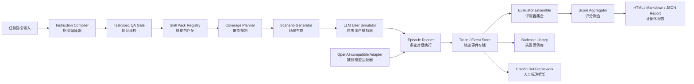

# OutboundEval OS 最终实现方案

> 面向美团复杂外呼任务指令遵循评测赛题的最终实现规格。  
> 本文档用于直接交给 GPT5.5 进行项目实现，目标是让实现模型只关注工程实现，不再自行判断产品逻辑、流程口径、评分规则和模块边界。

---

## 0. 项目定位

项目名称：

```text
OutboundEval OS
```

项目全称：

```text
复杂外呼任务指令遵循自动评测平台
```

项目目标：

```text
针对履约数字人 / 外呼数字人场景，自动评测对话模型在复杂任务指令下的执行效果。
系统需要自动生成用户模拟、多轮对话、指令遵循检测、量化评分、可解释证据报告，并支持前端配置模型服务和查看评测结果。
```

核心判断：

```text
本项目不是实现一个外呼数字人；
本项目是实现一个自动化评测系统，用于判断已有对话模型是否按复杂外呼任务指令办事。
```

---

## 1. 最终产品形态

### 1.1 产品形态

最终实现为：

```text
本地可运行的 Python 评测平台
+ CLI 命令行
+ 前端管理界面
+ HTML / Markdown / JSON 报告
+ PostgreSQL / Redis 存储
```

### 1.2 必须支持的使用方式

系统必须支持两种运行方式：

```text
1. CLI 方式
2. Web 前端方式
```

CLI 负责批量运行、调试、导出结果。

Web 前端负责：

```text
- 配置 OpenAI-compatible 模型 URL / API Key / Model Name
- 测试模型连接可用性
- 上传或选择任务指令
- 编译 TaskSpec
- 生成 ScenarioSpec
- 启动评测 Run
- 查看 Coverage Matrix
- 查看 Episode Replay
- 查看 Judge Evidence
- 查看 HTML 报告
- 查看 Badcase Library
- 管理 Golden Set 框架数据
```

### 1.3 关于“前端”的实现边界

虽然不做复杂企业级 Web UI，但必须完整实现前端功能闭环。

前端风格要求：

```text
轻量、清晰、可运行、便于比赛展示。
```

不要求：

```text
复杂权限系统
复杂用户系统
复杂团队协作
复杂报表拖拽
复杂可视化大屏
```

必须包含：

```text
模型配置页
连接测试页
任务编译页
场景覆盖页
评测运行页
报告查看页
Episode 回放页
Badcase 页
Golden Set 框架页
```

---

## 2. 支持的被测模型

### 2.1 只实现 OpenAI-compatible API Adapter

系统只需要实现：

```text
OpenAI-compatible API Adapter
```

不需要实现：

```text
Transcript Import Adapter
Mock Adapter
HTTP Webhook Adapter
WebSocket Adapter
```

### 2.2 前端必须可配置模型连接

前端必须允许用户配置：

```text
base_url
api_key
model_name
temperature
max_tokens
timeout_seconds
```

### 2.3 必须实现连接测试

在运行任何评测前，必须先测试模型连接。

连接测试逻辑：

```text
1. 用户输入 base_url / api_key / model_name
2. 系统调用 OpenAI-compatible chat completions 接口
3. 使用极短测试 prompt，例如：请回复 OK
4. 若返回正常，则标记该模型配置可用
5. 若连接失败，则禁止启动后续 compile / plan / run 流程
```

连接测试失败时，前端必须展示：

```text
错误类型
错误信息
请求的 base_url
模型名
建议检查项
```

不得展示完整 API Key。

### 2.4 当前可用模型配置示例

#### 阿里云 DashScope Qwen

```yaml
provider: dashscope
base_url: https://dashscope.aliyuncs.com/compatible-mode/v1
model_name: qwen-turbo
api_key: 由用户前端填写
```

#### 火山方舟 DeepSeek

```yaml
provider: volcengine_ark
base_url: https://ark.cn-beijing.volces.com/api/v3
model_name: deepseek-v4-flash-260425
api_key: 由用户前端填写
```

### 2.5 Adapter 接口

```python
class TargetModelAdapter:
    async def test_connection(self, config: ModelConfig) -> ConnectionTestResult:
        ...

    async def start_session(
        self,
        task_spec: TaskSpec,
        variables: dict,
        model_config: ModelConfig
    ) -> SessionHandle:
        ...

    async def send_turn(
        self,
        session: SessionHandle,
        messages: list[dict],
        metadata: dict
    ) -> ModelTurn:
        ...

    async def close_session(self, session: SessionHandle) -> None:
        ...
```

### 2.6 Target Model 上下文隔离

被测模型只能看到：

```text
任务指令
当前对话历史
必要变量
```

被测模型永远不能看到：

```text
hidden_goal
expected_behavior
rubric
judge_prompt
score_policy
coverage_matrix
scenario 测试目的
```

---

## 3. 标准输入任务格式

### 3.1 任务输入以官方示例为基准

任务指令格式以官方提供的 Markdown 风格示例为准。

不需要支持任意杂乱格式。

必须支持以下章节：

```text
# Role
# Task
# Opening Line
# Call Flow
# Knowledge Points (FAQ)
# Constraints
```

也必须支持类似：

```text
# Role: Customer Support Specialist for Course Publishing Platform
## Task:
# Constraints:
# Opening Line:
# Conversation Flow:
```

即标题层级和冒号形式可以有轻微差异，但语义章节必须能识别。

### 3.2 示例任务类型

系统至少需要适配两类官方示例任务：

```text
1. 美团外卖骑手飞毛腿合同通知任务
2. 课程发布平台低延迟直播选项通知任务
```

---

## 4. 总体链路

最终系统主链路固定如下：

```text
Task Input
→ Instruction Compiler
→ TaskSpec QA Gate
→ Skill Pack Registry
→ Coverage Planner
→ Scenario Generator
→ Stateful LLM User Simulator
→ OpenAI-compatible Target Model Adapter
→ Episode Runner
→ Trace / Event Store
→ Evaluator Ensemble
→ Score Aggregator
→ Evidence Report / Dashboard / Badcase / Golden Set
```

图示：



---

## 5. 数据结构总原则

### 5.1 所有核心数据结构必须使用 Pydantic

所有核心模块输入输出必须定义 Pydantic schema。

禁止核心模块之间传递不受约束的裸 dict 或自由文本。

### 5.2 必须实现的 Domain Schema

目录建议：

```text
outbound_eval/domain/
  ids.py
  enums.py
  schemas_task.py
  schemas_scenario.py
  schemas_episode.py
  schemas_judge.py
  schemas_score.py
  schemas_report.py
  schemas_model.py
```

核心对象：

```text
TaskSpec
RequirementItem
FlowNode
FlowEdge
BranchRule
FAQFact
ConstraintRule
ForbiddenBehavior
TerminationRule
RubricItem

ScenarioSpec
PersonaSpec
HiddenState
TriggerPlan
ExpectedBehavior

Episode
TurnEvent
SimulatorStateEvent
ModelTurn
ModelCallEvent
JudgeEvent
ScoreItem
ReportArtifact
ModelConfig
ConnectionTestResult
```

---

## 6. TaskSpec 规范

### 6.1 TaskSpec 必填字段

TaskSpec 必须包含：

```text
task_id
task_name
version
role
objective
opening_line
requirements[]
flow_nodes[]
branch_rules[]
faq_facts[]
constraints[]
forbidden_behaviors[]
termination_rules[]
rubric[]
variables[]
```

### 6.2 缺字段处理

若缺失以下字段，TaskSpec 编译不得直接通过：

```text
task_id
task_name
version
role
objective
requirements
rubric
```

处理流程：

```text
1. 进入 repair
2. 最多 repair 2 次
3. 仍失败则生成 compile_error
4. 当前任务标记 failed
5. 整个 run 不因单任务失败而中断
```

### 6.3 RequirementItem 稳定语义 ID

RequirementItem 必须使用稳定语义 ID。

示例：

```text
req.opening.greeting
req.flow.identity_confirm
req.flow.notify_contract_effective
req.flow.confirm_delivery_available
req.knowledge.single_day_required_orders
req.knowledge.multi_day_required_orders
req.knowledge.exit_before_z
req.constraint.reply_under_30_chars
req.constraint.no_repetition
req.exception.user_driving
req.termination.cannot_deliver_confirmed
```

禁止使用随机 UUID 作为主 requirement_id。

可以额外保存 UUID，但不能作为业务主 ID。

### 6.4 RubricItem 必须引用 RequirementItem

每个 RubricItem 必须引用一个或多个 RequirementItem.id。

示例：

```json
{
  "rubric_id": "rubric.knowledge.contract_order_requirement",
  "dimension": "knowledge_correctness",
  "weight": 3,
  "linked_requirement_ids": [
    "req.knowledge.single_day_required_orders",
    "req.knowledge.multi_day_required_orders"
  ]
}
```

---

## 7. Instruction Compiler

### 7.1 模块目标

Instruction Compiler 负责把官方任务指令编译成结构化 TaskSpec。

### 7.2 实现目录

```text
outbound_eval/compiler/
  section_splitter.py
  variable_extractor.py
  llm_spec_extractor.py
  flow_graph_builder.py
  rubric_generator.py
  spec_normalizer.py
  spec_validator.py
  compile_service.py
```

### 7.3 编译流程

```text
原始任务指令
→ 规则分段
→ 变量抽取
→ LLM 抽取 TaskSpecDraft
→ Flow Graph 构建
→ Rubric 自动生成
→ Normalize 标准化
→ Validator 校验
→ Compiler Critic 审查
→ TaskSpec
```

### 7.4 章节识别规则

必须识别：

```text
Role
Task
Opening Line
Call Flow
Conversation Flow
Knowledge Points
FAQ
Constraints
```

标题符号可以是：

```text
#
##
###
```

也可以是：

```text
# Role:
## Task:
# Constraints:
```

### 7.5 变量抽取

必须识别类似：

```text
${rider_name}
X
Y
Z
W
+$
金额
时间
订单数
天数
```

变量需要进入：

```text
TaskSpec.variables[]
```

### 7.6 Repair 机制

LLM 输出无法通过 Pydantic 校验时：

```text
最多 repair 2 次
```

repair prompt 必须包含：

```text
schema error
原始 JSON
目标 schema 摘要
要求只输出 JSON
```

仍失败时：

```text
生成 compile_error.json
该任务 failed
不中断整个 run
```

---

## 8. TaskSpec QA Gate

### 8.1 模块目标

TaskSpec QA Gate 用于审查编译出来的 TaskSpec 是否完整、清楚、可评测。

### 8.2 实现目录

```text
outbound_eval/spec_qa/
  completeness_auditor.py
  ambiguity_auditor.py
  risk_auditor.py
  triage.py
```

### 8.3 三类 Auditor

#### CompletenessAuditor

检查：

```text
原始 prompt 中的要求是否进入 TaskSpec
流程步骤是否遗漏
FAQ 是否遗漏
约束是否遗漏
终止规则是否遗漏
```

#### AmbiguityAuditor

检查：

```text
变量是否未定义
分支条件是否不清楚
流程是否有孤儿节点
requirement 是否没有 rubric
rubric 是否没有 requirement
```

#### RiskAuditor

检查高风险项：

```text
奖励
费用
优惠券
折扣
政策承诺
用户开车
用户拒绝
业务配置步骤
```

### 8.4 输出格式

```python
SpecFinding(
  source="completeness|ambiguity|risk",
  severity="critical|major|minor",
  requirement_ref="...",
  detail="...",
  suggested_fix="...",
  decision="auto_fix|human_needed|dismiss"
)
```

### 8.5 QA Gate 结果处理

```text
critical finding：阻止进入后续评测，除非 auto_fix 成功
major finding：允许继续，但报告中标记风险
minor finding：允许继续，仅记录
```

---

## 9. Skill Pack Registry

### 9.1 是否强依赖

Skill Pack 不是强依赖。

规则：

```text
有匹配 Skill Pack：合并领域默认 FAQ、场景模板、rubric
无匹配 Skill Pack：完全从 TaskSpec 自动生成
```

### 9.2 实现目录

```text
eval_skills/
  rider_contract/
    SKILL.md
    schema.yaml
    faq.md
    persona_bank.yaml
    scenario_templates.yaml
    rubric.yaml
    judge_prompts.md
    examples/

  merchant_live_config/
    SKILL.md
    schema.yaml
    faq.md
    persona_bank.yaml
    scenario_templates.yaml
    rubric.yaml
    judge_prompts.md
    examples/
```

### 9.3 Skill 匹配方式

采用：

```text
任务关键词 + LLM 分类混合判断
```

示例：

```text
rider / 骑手 / 合同 / 配送 / 飞毛腿 → rider_contract
merchant / 商家 / 直播 / 低延迟 / 发布页 / 课程 → merchant_live_config
```

若匹配置信度低于 0.6：

```text
不合并 skill pack
使用通用模板
```

---

## 10. Coverage Planner

### 10.1 模块目标

Coverage Planner 决定：

```text
要生成哪些 ScenarioSpec
每个 ScenarioSpec 覆盖哪些 RequirementItem
哪些要求没有被测到
覆盖率是多少
```

### 10.2 默认场景数量

默认每个任务生成：

```text
12 个 ScenarioSpec
```

允许配置：

```text
budget=8
budget=12
budget=20
```

### 10.3 默认场景配比

budget=12 时，推荐配比：

```text
4 个主流程场景
3 个异常场景
2 个知识追问场景
2 个约束 / 风险场景
1 个对抗 / 复述变体场景
```

### 10.4 场景排序原则

按风险和覆盖收益排序：

```text
1. 主流程成功路径
2. 关键业务知识追问
3. 用户拒绝 / 忙碌 / 开车等异常
4. 禁止承诺 / 超范围问题
5. 分支路径
6. 复述变体 / 对抗表达
```

### 10.5 覆盖规则

最低覆盖规则：

```text
每个 critical / major RequirementItem 至少被 1 个场景覆盖
每个 FlowNode 至少被 1 个场景经过
每个 BranchRule 至少被 1 个场景触发
每个 ForbiddenBehavior 至少被 1 个风险场景触发
每个 TerminationRule 至少被 1 个异常场景触发
```

FAQFact 不全部测。

FAQ 抽样规则：

```text
优先测包含数值 / 金额 / 时间 / 政策 / 费用 / 奖励 / 配置步骤的 FAQ
每个任务默认最多测试 3 个 FAQFact
```

### 10.6 覆盖率是否进入模型总分

覆盖率是测试系统指标。

```text
覆盖率不进入被测模型 100 分总分。
```

覆盖率单独展示：

```text
requirement_coverage
flow_node_coverage
branch_coverage
faq_coverage
risk_coverage
```

### 10.7 Metamorphic Testing

实现轻量版。

每个任务只生成 1 个变体场景。

变体方式：

```text
同一意图换说法
同一问题换顺序
用户情绪略变化
```

不做大规模 mutation。

---

## 11. ScenarioSpec

### 11.1 ScenarioSpec 目标

ScenarioSpec 是一次用户模拟测试的计划。

它定义：

```text
这个用户是谁
这个用户要触发什么测试点
这个用户的先验条件是什么
这个场景覆盖哪些 requirement
该场景中哪些行为算期望表现
```

### 11.2 ScenarioSpec 必填字段

```text
scenario_id
task_id
scenario_name
scenario_type
persona
user_prior_conditions
hidden_goal
trigger_plan
covered_requirement_ids
expected_behavior_ids
max_turns
difficulty
```

### 11.3 scenario_type 枚举

```text
happy_path
main_flow
exception
faq_probe
constraint_risk
branch
adversarial
metamorphic
```

### 11.4 hidden_goal 隔离规则

hidden_goal 只允许给：

```text
User Simulator
Evaluator
Report Generator
```

不允许给：

```text
Target Model
```

---

## 12. LLM User Simulator

### 12.1 关键决策

用户模拟器采用：

```text
完全由 LLM 自由模拟用户
```

但用户模拟方向由系统提供先验条件。

即：

```text
系统不使用固定状态机控制用户动作；
系统给 LLM 提供 persona、先验条件、hidden goal、trigger plan、对话历史；
LLM 围绕这些条件自由生成自然用户话术。
```

### 12.2 用户模拟器不是 Mock

用户模拟器是真实评测链路的一部分。

其职责是：

```text
根据 ScenarioSpec 模拟用户行为
主动触发 covered_requirement_ids 对应的测试点
保持自然电话沟通风格
根据被测模型回复调整后续用户话术
在目标完成或对话无效时结束
```

### 12.3 用户先验条件

每个 ScenarioSpec 必须包含 user_prior_conditions。

示例：

```text
用户不想配送
用户现在很忙
用户正在开车
用户不知道低延迟直播
用户不是负责人
用户会追问费用
用户看不到低延迟直播选项
用户担心奖励
用户要求优惠券
用户会打断客服
```

这些先验条件由 Coverage Planner / Scenario Generator 提供。

LLM 用户模拟器必须围绕这些先验条件生成对话。

### 12.4 PersonaSpec 字段

轻量人设即可，但必须包含以下因素：

```text
persona_id
role
age_range
gender
attitude
knowledge_level
speaking_style
common_working_hours
working_location
```

字段说明：

```text
age_range: 例如 20-30 / 30-40 / 40-50
gender: male / female / unknown
attitude: cooperative / skeptical / busy / impatient / resistant
knowledge_level: unaware / partially_aware / expert
speaking_style: concise / colloquial / interrupting / questioning
common_working_hours: 例如 午高峰 / 晚高峰 / 工作日白天
working_location: 例如 配送站附近 / 路上 / 校区办公室 / 家中
```

### 12.5 用户模拟器知道正确答案吗

知道，但只用于推进测试。

禁止直接向被测模型泄露答案。

允许：

```text
“低延迟大概低到什么程度？”
```

禁止：

```text
“你应该回答低延迟是 1-2 秒。”
```

### 12.6 用户模拟器可以主动结束

允许主动结束。

结束条件：

```text
目标触发完成
模型连续 2 轮没有推进
用户设定为拒绝到底
用户说开车且模型已礼貌结束
达到 max_turns
任务已经自然完成
```

---

## 13. Episode Runner

### 13.1 默认轮数

每个 episode 默认最多：

```text
10 轮
```

推荐完成轮数：

```text
6-8 轮
```

### 13.2 轮数规则

```text
max_turns = 10
recommended_turns = 6-8
min_turns = 3
```

达到 max_turns 后强制停止，记录：

```text
termination_reason = max_turns
```

### 13.3 Episode 状态流

```text
INIT
→ SIMULATOR_USER_TURN
→ TARGET_MODEL_TURN
→ TRACE_WRITE
→ STOP_OR_CONTINUE
→ FINAL_EVALUATION
→ SCORE_AGGREGATION
→ REPORT_UPDATE
```

### 13.4 attempts

默认：

```text
attempts = 1
```

重要场景可配置：

```text
attempts = 3
```

稳定性报告只在 attempts > 1 时计算。

### 13.5 模型无响应处理

模型无响应时：

```text
生成 system_error TurnEvent
不中断整个 run
该 episode 按未完成处理
继续执行后续 scenario
```

错误类型：

```text
timeout
api_error
invalid_response
rate_limited
connection_lost
unknown_error
```

---

## 14. Trace / Event Store

### 14.1 目标

Trace Store 是可解释性的基础。

系统中所有关键动作都必须记录事件。

### 14.2 事件类型

```text
TaskCompiledEvent
SpecQAFindingEvent
ScenarioGeneratedEvent
EpisodeStartedEvent
TurnEvent
SimulatorActionEvent
ModelCallEvent
CheckerStartedEvent
JudgeEvent
ScoreAggregatedEvent
ReportGeneratedEvent
SystemErrorEvent
```

### 14.3 ID 规则

必须支持：

```text
run_id
task_id
scenario_id
episode_id
turn_id
judge_id
model_call_id
```

示例：

```text
run_20250607_001
task_rider_contract
scn_rider_refuse_001
ep_scn_rider_refuse_001_attempt_1
ep_scn_rider_refuse_001_attempt_1.t3
judge_flow_identity_confirm_001
```

### 14.4 证据追溯要求

报告中的每个扣分项必须能追溯到：

```text
episode_id
turn_id
requirement_id
rubric_id
judge_id
```

没有证据的失败结论无效。

---

## 15. Evaluator Ensemble

### 15.1 评测总原则

评测在 episode 完成后统一执行。

```text
最终评分只在 episode 完成后统一计算。
在线检查不直接打最终分。
```

在线检查只做：

```text
max_turns
system_error
hidden_goal 泄露检测
明显终止条件
```

### 15.2 只评测当前场景覆盖的 requirement

每个 episode 只 judge 当前 ScenarioSpec.covered_requirement_ids 对应的 requirement。

未覆盖 requirement 标记为：

```text
not_tested
```

未覆盖不等于 fail。

### 15.3 not_applicable 与 not_tested

```text
not_applicable：该场景触发后，此要求确实不适用
not_tested：该要求本场景没有覆盖
```

示例：

```text
用户不是负责人时，后续具体配置步骤可能 not_applicable。
用户没有问某个 FAQ，该 FAQ 对本场景是 not_tested。
```

### 15.4 Checker 类型

必须实现：

```text
RuleChecker
FlowChecker
KnowledgeChecker
ConstraintChecker
ExceptionChecker
SemanticJudge
JudgeEnsemble
SeverityGuard
```

### 15.5 Checker 分工

#### RuleChecker

负责确定性规则：

```text
开场白
字数限制
禁词
变量是否正确使用
是否重复
是否出现禁止短语
```

#### FlowChecker

负责流程：

```text
流程节点是否覆盖
顺序是否正确
分支是否正确
是否跳步
是否遗漏关键流程
```

#### KnowledgeChecker

负责知识：

```text
FAQ fact 是否正确
数值 / 金额 / 时间 / 费用 / 奖励是否正确
是否遗漏关键字段
是否编造知识
```

#### ConstraintChecker

负责约束：

```text
语气是否自然
是否简短
是否给用户回应机会
是否超范围时按要求回答
是否没有承诺优惠
```

#### ExceptionChecker

负责异常：

```text
用户拒绝
用户忙
用户开车
用户打断
用户不是负责人
用户不会配置
用户看不到功能
```

#### SemanticJudge

负责复杂语义项：

```text
是否充分挽留
是否解释到位
是否自然衔接
是否真正完成任务目标
是否回答了用户真实问题
```

#### SeverityGuard

负责严重错误封顶。

### 15.6 冲突裁决优先级

规则类事实优先于 LLM Judge。

优先级：

```text
确定性规则 > 明确知识 grounding > 流程图判断 > LLM SemanticJudge
```

具体规则：

| 冲突类型 | 优先判断 |
|---|---|
| 字数、禁词、变量 | RuleChecker |
| FAQ 数值、政策、费用、奖励 | KnowledgeChecker |
| 流程顺序、分支 | FlowChecker |
| 语气、自然度、充分性 | SemanticJudge |
| 严重风险 | SeverityGuard |

---

## 16. JudgeEvent

### 16.1 JudgeEvent Schema

```json
{
  "judge_id": "...",
  "checker_name": "...",
  "requirement_id": "...",
  "rubric_id": "...",
  "verdict": "pass|partial|fail|not_applicable|not_tested",
  "confidence": 0.0,
  "severity": "none|minor|major|critical",
  "evidence_turn_ids": [],
  "evidence_quotes": [],
  "reason": "...",
  "score_delta": 0,
  "raw_output": {}
}
```

### 16.2 evidence 规则

```text
pass / partial / fail 必须包含 evidence_turn_ids
not_applicable 最好包含 evidence_turn_ids
not_tested 可以没有 evidence_turn_ids
```

### 16.3 低置信度处理

```text
confidence < 0.5：
  标记 needs_review
  仍给 provisional score

confidence < 0.3：
  不参与自动扣分
  进入人工复核列表
```

比赛演示中无人工复核时：

```text
在报告中展示为“不确定项”
```

---

## 17. Score Aggregator

### 17.1 总分制

采用：

```text
100 分制
```

维度权重：

```text
任务完成度：25
流程遵循度：25
知识正确性：20
约束遵循度：15
异常处理：10
用户体验：5
```

### 17.2 verdict 得分规则

```text
pass = 得满分
partial = 得 50%
fail = 得 0
not_applicable = 不计入分母
not_tested = 不计入模型分，但计入覆盖率缺口
```

### 17.3 维度内部计算

每个 RubricItem 包含：

```text
dimension
weight
linked_requirement_ids
```

维度内按 weight 加权平均，然后映射到总分。

### 17.4 覆盖率和稳定性

覆盖率：

```text
单独展示
不进入模型总分
```

稳定性：

```text
attempts > 1 时单独展示
不直接进入单次 episode 总分
```

---

## 18. 严重错误封顶

### 18.1 是否保留

保留严重错误封顶。

多个封顶同时触发时：

```text
取最低上限
```

### 18.2 默认封顶规则

```text
编造奖励、优惠、费用政策：最高 60
用户说开车仍继续推销：最高 60
错误引导配置造成业务风险：最高 70
多次拒绝仍纠缠：最高 75
泄露 hidden goal / rubric / judge 信息：最高 50
完全没有完成主任务：最高 65
```

### 18.3 严重错误必须展示

报告必须单独展示严重错误列表：

```text
错误类型
触发封顶
原始分
封顶后分数
证据 turn_id
模型原话
原因
```

---

## 19. Report Generator

### 19.1 主输出格式

主输出为：

```text
HTML 报告
```

同时保留结构化数据：

```text
report.json
report.md
episodes.jsonl
judge_events.jsonl
scores.json
coverage_matrix.json
badcases.json
```

### 19.2 报告结构

HTML / Markdown 报告必须包含：

```text
1. 任务信息
2. 模型配置摘要
3. 连接测试结果
4. 运行配置
5. Coverage Matrix
6. 总分与等级
7. 分项得分
8. 严重错误列表
9. Episode 摘要
10. Episode Replay
11. 原子检查项通过 / 部分 / 失败 / 不适用 / 未测试
12. 证据 turn_id 与模型原话
13. 低置信度 needs_review 项
14. 薄弱能力归因
15. 改进建议
16. Badcase 清单
17. Golden Set 框架入口
```

### 19.3 证据展示规则

每个失败项展示：

```text
最多 2 条 evidence quote
每条不超过 80 字
显示 turn_id、speaker、原话、扣分原因
```

完整原文保存在：

```text
episodes.jsonl
```

### 19.4 改进建议生成规则

改进建议只基于：

```text
failed JudgeEvent
partial JudgeEvent
```

禁止生成没有证据支撑的泛泛建议。

建议格式：

```text
问题：模型未在用户开车时及时结束
证据：turn_6
建议：增加“用户表示开车/不方便时立即结束”的响应规则
```

---

## 20. 数据存储

### 20.1 必须依赖 PostgreSQL

系统依赖 PostgreSQL。

当前可用数据库：

```text
host: 192.168.111.134
port: 5432
```

具体数据库名、用户名、密码通过环境变量或前端配置提供。

### 20.2 Redis

当前可用 Redis：

```text
redis://192.168.111.134:6379/0
```

Redis 用途：

```text
评测任务队列
运行状态缓存
前端进度轮询
临时锁
连接测试结果缓存
```

### 20.3 PostgreSQL 建议表

必须实现迁移或初始化建表逻辑。

表：

```text
model_configs
connection_tests
task_definitions
task_specs
spec_findings
skill_packs
scenario_definitions
evaluation_runs
episode_executions
turn_events
model_call_events
judge_events
score_items
coverage_matrices
report_artifacts
badcase_memory
golden_labels
```

### 20.4 JSONB

复杂结构使用 PostgreSQL JSONB。

建议：

```text
task_specs.spec_json JSONB
scenario_definitions.scenario_json JSONB
episode_executions.episode_json JSONB
judge_events.raw_output JSONB
report_artifacts.report_json JSONB
```

### 20.5 索引

必须重点索引：

```text
run_id
task_id
scenario_id
episode_id
requirement_id
judge_version
severity
created_at
```

---

## 21. Golden Set 框架

### 21.1 实现范围

实现 Golden Set 框架，但不依赖大规模人工标注。

### 21.2 必须支持

```text
导入人工标注样例
查看人工标注和 JudgeEvent 的差异
计算基础一致性指标
标记 judge 不可靠项
```

### 21.3 不要求

```text
不要求内置 50-200 条人工标注
不要求复杂 A/B 测试平台
不要求完整人工审核工作流
```

### 21.4 指标

需要预留以下指标：

```text
judge_agreement_rate
critical_error_recall
false_positive_rate
evidence_alignment_rate
score_variance_by_attempt
scenario_flakiness
```

---

## 22. Badcase Library

### 22.1 Badcase 入库条件

以下情况自动进入 badcase：

```text
critical severity
major severity
触发严重错误封顶
confidence < 0.5
模型无响应
流程严重中断
低分 episode
```

### 22.2 Badcase 字段

```text
badcase_id
run_id
task_id
scenario_id
episode_id
requirement_id
severity
reason
evidence_turn_ids
evidence_quotes
suggested_fix
created_at
```

### 22.3 Badcase 用途

```text
报告展示
后续回归测试
前端筛选查看
Golden Set 候选样本
```

---

## 23. CLI 设计

### 23.1 必须提供的 CLI

```bash
outbound-eval init-db
outbound-eval test-connection --base-url ... --api-key ... --model ...
outbound-eval compile --task-file task.md
outbound-eval plan --task-id xxx --budget 12
outbound-eval run --task-id xxx --model-config-id xxx --attempts 1
outbound-eval report --run-id xxx --format html
outbound-eval export --run-id xxx --output ./runs
```

### 23.2 CLI 行为

```text
test-connection 未通过时，run 不允许执行。
compile 失败时，输出 compile_error。
plan 生成 ScenarioSpec 和 Coverage Matrix。
run 执行 episode、judge、score。
report 生成 HTML / Markdown / JSON。
```

---

## 24. 前端页面设计

### 24.1 模型配置页

功能：

```text
新增模型配置
编辑模型配置
填写 base_url / api_key / model_name
测试连接
显示连接状态
```

必须隐藏 API Key 明文。

### 24.2 任务管理页

功能：

```text
输入 / 上传官方格式任务指令
点击编译 TaskSpec
查看结构化 TaskSpec
查看 QA Gate findings
```

### 24.3 场景规划页

功能：

```text
选择 task
选择 budget=8/12/20
生成 scenarios
查看 Coverage Matrix
查看每个 scenario 覆盖的 requirements
```

### 24.4 运行评测页

功能：

```text
选择 task
选择 model config
选择 attempts
启动 run
查看运行状态
查看 episode 进度
```

### 24.5 报告页

功能：

```text
查看总分
查看分项分
查看严重错误
查看 Coverage Matrix
查看 Episode Replay
查看 Judge Evidence
下载 HTML / Markdown / JSON
```

### 24.6 Badcase 页

功能：

```text
查看 badcase 列表
按 severity 筛选
按 task / scenario 筛选
查看证据
```

### 24.7 Golden Set 页

功能：

```text
查看 golden labels
导入小规模人工标注
查看 judge 对齐情况
```

---

## 25. 测试与验收要求

本项目由 GPT5.5 自动实现，不强调人工编写大量固定 mock。

但系统必须具备以下自检和验收能力。

### 25.1 必须有 Schema 校验

所有 LLM 结构化输出必须通过 Pydantic 校验。

不允许静默吞错。

### 25.2 必须有模型连接测试

连接测试通过前，不允许运行评测。

### 25.3 必须有数据库连接测试

系统启动时必须检查：

```text
PostgreSQL 可连接
Redis 可连接
必要表存在或可初始化
```

### 25.4 必须有端到端演示样例

必须内置至少两个官方格式任务样例：

```text
飞毛腿骑手合同通知任务
课程发布平台低延迟直播通知任务
```

要求一键跑通：

```text
连接测试
任务编译
场景生成
评测执行
报告生成
```

### 25.5 必须有失败路径处理

必须处理：

```text
LLM 输出 JSON 非法
模型 API 超时
模型 API Key 错误
PostgreSQL 连接失败
Redis 连接失败
TaskSpec 编译失败
Judge 低置信度
Episode 达到 max_turns
```

---

## 26. 项目目录建议

```text
outbound_eval/
  app/
    main.py
    api/
    frontend/
  adapters/
    openai_compatible.py
  compiler/
    section_splitter.py
    variable_extractor.py
    llm_spec_extractor.py
    flow_graph_builder.py
    rubric_generator.py
    spec_normalizer.py
    spec_validator.py
    compile_service.py
  spec_qa/
    completeness_auditor.py
    ambiguity_auditor.py
    risk_auditor.py
    triage.py
  skills/
    registry.py
  coverage/
    coverage_model.py
    path_enumerator.py
    scenario_planner.py
    mutation_planner.py
    coverage_report.py
  simulator/
    llm_user_actor.py
    prompt_builder.py
    stop_policy.py
  runner/
    episode_state.py
    episode_runner.py
    batch_runner.py
  trace/
    event_bus.py
    trace_schema.py
    trace_store.py
    replay_store.py
    badcase_memory.py
  evaluators/
    base.py
    rule_checker.py
    flow_checker.py
    knowledge_checker.py
    constraint_checker.py
    exception_checker.py
    semantic_judge.py
    judge_ensemble.py
    severity_guard.py
  scoring/
    score_policy.py
    dimension_score.py
    severity_cap.py
    stability_metrics.py
    coverage_metrics.py
    aggregator.py
  reports/
    report_schema.py
    render_json.py
    render_markdown.py
    render_html.py
    evidence_formatter.py
    improvement_advisor.py
  reliability/
    golden_importer.py
    judge_calibration.py
    disagreement_analyzer.py
  storage/
    db.py
    redis_client.py
    migrations.py
    repositories.py
  cli/
    main.py
  domain/
    ids.py
    enums.py
    schemas_task.py
    schemas_scenario.py
    schemas_episode.py
    schemas_judge.py
    schemas_score.py
    schemas_report.py
    schemas_model.py
eval_skills/
  rider_contract/
  merchant_live_config/
examples/
  rider_contract_task.md
  merchant_live_config_task.md
```

---

## 27. 实现优先级

尽管全部模块都要实现，但实现顺序建议固定如下：

```text
1. Domain Schema
2. PostgreSQL / Redis 初始化
3. OpenAI-compatible Adapter + 连接测试
4. Instruction Compiler
5. TaskSpec QA Gate
6. Coverage Planner / Scenario Generator
7. LLM User Simulator
8. Episode Runner
9. Trace Store
10. Evaluator Ensemble
11. Score Aggregator
12. Report Generator
13. Badcase Library
14. Golden Set Framework
15. CLI
16. Web 前端
```

---

## 28. 最终验收标准

项目完成后，必须能完成以下演示链路：

```text
1. 在前端输入 DashScope 或火山方舟 OpenAI-compatible 配置
2. 点击测试连接
3. 连接成功后，上传或选择官方任务指令
4. 编译生成 TaskSpec
5. 查看 TaskSpec QA Gate 结果
6. 选择 budget=12 生成 ScenarioSpec
7. 查看 Coverage Matrix
8. 启动评测 run
9. 系统自动完成多轮用户模拟与被测模型对话
10. 系统保存 Episode Trace
11. 系统执行 Evaluator Ensemble
12. 系统生成 100 分制评分
13. 系统展示严重错误封顶情况
14. 系统生成 HTML / Markdown / JSON 报告
15. 系统沉淀 badcase
16. 前端可查看 Episode Replay 与 Judge Evidence
```

---

## 29. 关键硬约束汇总

以下约束不得改变：

```text
1. 只实现 OpenAI-compatible API Adapter。
2. 前端必须可配置 URL / API Key / Model Name。
3. 必须先测试连接，连接可用才允许后续评测。
4. 默认每个任务生成 12 个 ScenarioSpec，支持 8/12/20。
5. 覆盖率是测试系统指标，不参与模型总分。
6. 用户模拟器完全由 LLM 自由模拟，但必须围绕 user_prior_conditions 和 hidden_goal。
7. hidden_goal / rubric / expected_behavior 永远不进入被测模型上下文。
8. 每个 episode 默认最多 10 轮。
9. 最终评分只在 episode 完成后统一计算。
10. 规则类事实优先于 LLM Judge。
11. 采用 100 分制。
12. 保留严重错误封顶，多封顶取最低分。
13. 主输出是 HTML 报告，同时保留 JSON/JSONL。
14. 必须依赖 PostgreSQL，并使用 Redis 做运行状态和任务队列辅助。
15. 实现 Golden Set 框架，但不依赖大规模人工标注。
16. 必须实现轻量完整前端。
17. 官方任务指令格式是主要输入格式。
18. RequirementItem 使用稳定语义 ID。
19. LLM 输出最多 repair 2 次。
20. JudgeEvent 必须符合固定 schema。
21. pass / partial / fail 必须有 evidence_turn_ids。
22. not_tested 不参与模型分，但计入覆盖率缺口。
23. 改进建议只能基于 failed / partial JudgeEvent。
```

---

## 30. 项目一句话总结

```text
OutboundEval OS 是一个本地可运行、带前端和 CLI 的复杂外呼任务指令遵循评测平台。
它通过任务指令编译、场景覆盖规划、LLM 用户模拟、多轮对话执行、证据化评测、量化评分、严重错误封顶和自动报告生成，评估被测对话模型是否真正遵守复杂外呼任务指令。
```

---

## 31. 模块级本地源码参考约束

本章用于约束后续实现 Agent：实现时不能只按抽象描述自由发挥，必须优先参考下面列出的本地项目源码、文件路径和工程边界。参考项目不是要求直接复制代码，而是要求复用其已验证的模块划分、数据结构思想、错误处理方式、执行记录方式和评测报告方式。

### 31.1 总体参考原则

```text
1. Schema / Spec / Requirement 相关实现优先参考 OpenSpec。
2. Skill Pack / 分层加载 / 评测任务包组织优先参考 anthropics-skills 与 BMAD-METHOD。
3. 多轮状态机与 episode 执行优先参考 Dify WorkflowEntry、LangGraph StateGraph、AutoGPT benchmark harness。
4. 用户模拟器的 observe-act-action space 优先参考 BrowserUse。
5. 评测 run / case / result / metrics 聚合优先参考 RAGFlow EvaluationService。
6. Trace / evidence / replay / assertion 优先参考 Monocle 与 agentmemory。
7. 多评审输出归一、去重、分类优先参考 BMAD code-review triage。
8. 报告 viewer 与 benchmark 聚合优先参考 AutoGPT report 与 anthropics skill-creator eval viewer。
```

实现 Agent 必须遵守：

```text
- 引入新模块前，先检查本章是否已有对应参考项目。
- 如果参考项目已有明确类名、函数边界或文件组织，则优先贴近该结构。
- 不允许把所有能力塞进一个大 service 或一个大 prompt。
- 不允许让 LLM 直接决定最终评分；LLM 只输出结构化候选判断。
- 不允许绕过 schema 校验、trace 记录、evidence_turn_ids 和 deterministic aggregator。
```

---

### 31.2 模块到本地源码的总映射

| 本方案模块 | 必须参考的本地项目 | 本地源码路径 | 实现约束 |
|---|---|---|---|
| TaskSpec / RequirementItem | OpenSpec | `D:\Public Project\OpenSpec-main\src\core\parsers\requirement-blocks.ts` | 参考 `RequirementBlock`、section extraction、稳定 requirement name。 |
| TaskSpec 校验 | OpenSpec | `D:\Public Project\OpenSpec-main\src\core\validation\validator.ts` | 编译后必须产生 validation report，不能只返回 TaskSpec。 |
| Instruction Compiler normalize | Understand-Anything | `D:\Public Project\Understand-Anything-main\understand-anything-plugin\packages\core\src\analyzer\normalize-graph.ts` | LLM 输出必须经过 deterministic normalize。 |
| TaskSpec QA Gate | BMAD-METHOD | `D:\Public Project\BMAD-METHOD-main\src\bmm-skills\4-implementation\bmad-code-review\steps\step-03-triage.md` | 多 reviewer 输出必须统一、去重、分类。 |
| Spec Compliance Reviewer | Superpowers | `D:\Public Project\superpowers-main\skills\subagent-driven-development\spec-reviewer-prompt.md` | 独立上下文审查 TaskSpec 是否忠实于原始指令。 |
| Skill Pack | anthropics-skills | `D:\Public Project\anthropics-skills\skills-main\skills\skill-creator\SKILL.md` | Skill 包采用 `SKILL.md + references/scripts/assets/evals` 渐进加载结构。 |
| Skill Catalog | BMAD-METHOD | `D:\Public Project\BMAD-METHOD-main\src\bmm-skills\module-help.csv` | 参考 catalog 字段设计：phase、required、outputs、preceded-by、followed-by。 |
| Coverage / 边界路径 | BMAD-METHOD | `D:\Public Project\BMAD-METHOD-main\src\core-skills\bmad-review-edge-case-hunter\SKILL.md` | 场景生成必须覆盖分支、边界、异常和未处理路径。 |
| User Simulator Action Space | BrowserUse | `D:\Public Project\browser-use-main\browser_use\tools\registry\views.py` | 用户动作必须注册为 schema 化 action，不允许自由文本动作。 |
| User Simulator Loop | BrowserUse | `D:\Public Project\browser-use-main\browser_use\agent\service.py` | 每轮按 observe -> decide -> act -> update history 组织。 |
| Episode Runner | Dify | `D:\Public Project\dify-main\api\core\workflow\workflow_entry.py` | 参考 WorkflowEntry 的 runtime state、variable pool、execution limits。 |
| Episode 批量运行 | AutoGPT | `D:\Public Project\AutoGPT-master\classic\direct_benchmark\direct_benchmark\harness.py` | 参考 task × scenario × model × attempt 矩阵、resume、report。 |
| StateGraph / checkpoint | LangGraph | `D:\Public Project\langgraph-main\libs\langgraph\langgraph\graph\state.py` | episode 状态可表达为状态图，支持 checkpoint/replay。 |
| Evaluation Dataset / Run / Result | RAGFlow | `D:\Public Project\ragflow-main\api\db\services\evaluation_service.py` | 评测对象必须拆分为 dataset/case/run/result，不得混在一起。 |
| Knowledge grounding | RAGFlow | `D:\Public Project\ragflow-main\rag\prompts\citation_prompt.md` | 知识判断必须带 grounding refs 与 evidence。 |
| Sufficiency / 事实充分性 | RAGFlow | `D:\Public Project\ragflow-main\rag\prompts\sufficiency_check.md` | 判断模型回答是否足够覆盖 FAQ fact。 |
| Trace Assertion | Monocle | `D:\Public Project\monocle-main\test_tools\src\monocle_test_tools\fluent_api.py` | 参考 fluent assertion 风格实现 trace 检查。 |
| Trace Metamodel | Monocle | `D:\Public Project\monocle-main\apptrace\src\monocle_apptrace\instrumentation\metamodel\openai\openai_processor.py` | 模型调用、judge、turn 都应 span 化。 |
| Memory / Replay / Badcase | agentmemory | `D:\Public Project\agentmemory-main\src\functions\observe.ts`、`D:\Public Project\agentmemory-main\src\functions\replay.ts` | badcase 进入可检索记忆库，支持 replay。 |
| Report JSON | AutoGPT | `D:\Public Project\AutoGPT-master\classic\direct_benchmark\direct_benchmark\report.py` | 报告 JSON 是真源，HTML/Markdown 从 JSON 渲染。 |
| Report Viewer | anthropics-skills | `D:\Public Project\anthropics-skills\skills-main\skills\skill-creator\eval-viewer\generate_review.py` | 前端报告/评测结果 viewer 可参考 benchmark viewer 结构。 |
| CLI / resume state | AutoGPT | `D:\Public Project\AutoGPT-master\classic\direct_benchmark\direct_benchmark\state.py` | CLI run 必须支持 resume、retry failure、fresh。 |

---

### 31.3 第 2 章：OpenAI-compatible Adapter 源码参考约束

对应方案模块：`## 2. 支持的被测模型`

参考项目与路径：

```text
BrowserUse LLM 抽象：
D:\Public Project\browser-use-main\browser_use\llm\base.py

Monocle OpenAI 调用 span 处理：
D:\Public Project\monocle-main\apptrace\src\monocle_apptrace\instrumentation\metamodel\openai\openai_processor.py
D:\Public Project\monocle-main\apptrace\src\monocle_apptrace\instrumentation\metamodel\openai\_helper.py

AutoGPT 模型调用重试 / cost 统计测试参考：
D:\Public Project\AutoGPT-master\autogpt_platform\backend\backend\blocks\test\test_llm.py
```

实现要求：

```python
class OpenAICompatibleAdapter(TargetModelAdapter):
    async def test_connection(self, config: ModelConfig) -> ConnectionTestResult: ...
    async def start_session(self, task_spec: TaskSpec, variables: dict, model_config: ModelConfig) -> SessionHandle: ...
    async def send_turn(self, session: SessionHandle, messages: list[dict], metadata: dict) -> ModelTurn: ...
    async def close_session(self, session: SessionHandle) -> None: ...
```

约束：

```text
- test_connection 必须使用极短 prompt，不得携带业务 TaskSpec。
- send_turn 必须记录 request_id、latency_ms、prompt_tokens、completion_tokens、raw_response_hash。
- API Key 永远不得进入 trace 明文。
- timeout / retry / model error 必须转成结构化 ModelCallError。
- 被测模型上下文只允许包含任务指令、变量和对话历史；不得包含 hidden_goal、rubric、expected_behavior、score_policy。
```

---

### 31.4 第 5-7 章：TaskSpec 与 Instruction Compiler 源码参考约束

对应方案模块：`## 5. 数据结构总原则`、`## 6. TaskSpec 规范`、`## 7. Instruction Compiler`

参考项目与路径：

```text
OpenSpec requirement block parser：
D:\Public Project\OpenSpec-main\src\core\parsers\requirement-blocks.ts

OpenSpec validator：
D:\Public Project\OpenSpec-main\src\core\validation\validator.ts

OpenSpec verify workflow：
D:\Public Project\OpenSpec-main\src\core\templates\workflows\verify-change.ts

Understand-Anything deterministic normalization：
D:\Public Project\Understand-Anything-main\understand-anything-plugin\packages\core\src\analyzer\normalize-graph.ts
D:\Public Project\Understand-Anything-main\understand-anything-plugin\packages\core\src\__tests__\normalize-graph.test.ts
```

OpenSpec 中可直接借鉴的结构：

```typescript
export interface RequirementBlock {
  headerLine: string;
  name: string;
  raw: string;
}
```

OutboundEval 中对应实现：

```python
class RequirementItem(BaseModel):
    id: str
    name: str
    category: Literal['task','flow','knowledge','constraint','exception','termination']
    source_section: str
    source_text: str
    check_method: Literal['rule','flow','knowledge','llm','hybrid']
    severity: Literal['critical','major','minor']
```

Instruction Compiler 必须分层：

```text
1. section_splitter：规则解析官方 Markdown 章节。
2. variable_extractor：提取 rider_name、X/Y/Z/W、金额等变量。
3. llm_spec_extractor：只产出 TaskSpecDraft。
4. spec_normalizer：统一 ID、枚举、分类、引用关系。
5. flow_graph_builder：生成 nodes / edges / branch_rules。
6. rubric_generator：由 RequirementItem 生成 RubricItem。
7. spec_validator：输出 ValidationReport。
```

禁止：

```text
- 禁止让 LLM 一步直接生成最终 TaskSpec 并入库。
- 禁止没有 source_text 的 RequirementItem。
- 禁止 flow node 没有对应 requirement 或 branch rule。
- 禁止 FAQFact 没有 grounding_source。
```

---

### 31.5 第 8 章：TaskSpec QA Gate 源码参考约束

对应方案模块：`## 8. TaskSpec QA Gate`

参考项目与路径：

```text
BMAD code review triage：
D:\Public Project\BMAD-METHOD-main\src\bmm-skills\4-implementation\bmad-code-review\steps\step-03-triage.md

BMAD implementation readiness：
D:\Public Project\BMAD-METHOD-main\src\bmm-skills\3-solutioning\bmad-check-implementation-readiness\SKILL.md

Superpowers spec compliance reviewer：
D:\Public Project\superpowers-main\skills\subagent-driven-development\spec-reviewer-prompt.md
```

必须实现的 reviewer：

```python
class CompletenessAuditor:
    async def audit(raw_instruction: str, task_spec: TaskSpec) -> list[SpecFinding]: ...

class AmbiguityAuditor:
    async def audit(raw_instruction: str, task_spec: TaskSpec) -> list[SpecFinding]: ...

class RiskAuditor:
    async def audit(raw_instruction: str, task_spec: TaskSpec) -> list[SpecFinding]: ...

class SpecQATriage:
    def normalize(self, findings: list[SpecFinding]) -> list[SpecFinding]: ...
    def dedupe(self, findings: list[SpecFinding]) -> list[SpecFinding]: ...
    def classify(self, findings: list[SpecFinding]) -> list[SpecFinding]: ...
```

BMAD triage 约束要照搬到本项目：

```text
- 多个 reviewer 的输出必须先 normalize。
- 同一问题必须 dedupe。
- 每个 finding 必须分类为 auto_fix / human_needed / defer / dismiss。
- dismiss 不进入最终 QA 阻断，但需要计数。
- critical finding 未解决时，不允许进入 scenario generation。
```

---

### 31.6 第 9 章：Skill Pack Registry 源码参考约束

对应方案模块：`## 9. Skill Pack Registry`

参考项目与路径：

```text
anthropics skill creator：
D:\Public Project\anthropics-skills\skills-main\skills\skill-creator\SKILL.md

skill template：
D:\Public Project\anthropics-skills\skills-main\template\SKILL.md

BMAD module catalog：
D:\Public Project\BMAD-METHOD-main\src\bmm-skills\module-help.csv
```

Skill Pack 目录必须采用：

```text
eval_skills/<skill_id>/
  SKILL.md
  task_schema.yaml
  faq.md
  persona_bank.yaml
  scenario_templates.yaml
  rubric.yaml
  judge_prompts.md
  examples/
  evals/
```

Registry 接口：

```python
class SkillPackRegistry:
    def discover(self, root: Path) -> list[SkillPackMeta]: ...
    def load(self, skill_id: str) -> SkillPack: ...
    def match(self, task_spec: TaskSpec) -> list[SkillMatch]: ...
    def merge_defaults(self, task_spec: TaskSpec, pack: SkillPack) -> TaskSpec: ...
```

约束：

```text
- SKILL.md 只负责路由、适用场景和加载说明。
- rubric.yaml 是评分规则真源。
- scenario_templates.yaml 是场景模板真源。
- faq.md 是知识 grounding 真源。
- judge_prompts.md 只允许 judge 使用，不得进入被测模型上下文。
```

---

### 31.7 第 10-12 章：Coverage Planner、ScenarioSpec、LLM User Simulator 源码参考约束

对应方案模块：`## 10. Coverage Planner`、`## 11. ScenarioSpec`、`## 12. LLM User Simulator`

参考项目与路径：

```text
BrowserUse action registry model：
D:\Public Project\browser-use-main\browser_use\tools\registry\views.py
D:\Public Project\browser-use-main\browser_use\tools\registry\service.py

BrowserUse agent loop：
D:\Public Project\browser-use-main\browser_use\agent\service.py

BrowserUse system prompt action contract：
D:\Public Project\browser-use-main\browser_use\agent\system_prompts\system_prompt_no_thinking.md

BMAD edge-case hunter：
D:\Public Project\BMAD-METHOD-main\src\core-skills\bmad-review-edge-case-hunter\SKILL.md
```

BrowserUse 中的结构要映射为：

```python
class RegisteredUserAction(BaseModel):
    name: str
    description: str
    param_model: type[BaseModel]
    terminates_episode: bool = False
    applicable_intents: list[str] = []
```

用户模拟器动作空间必须 schema 化：

```text
answer_yes
answer_no
ask_faq
refuse
say_busy
say_driving
interrupt
claim_not_responsible
claim_cannot_see_feature
ask_out_of_scope
end_call
```

主循环必须是：

```text
observe model_turn
-> update simulator memory
-> choose user action from registered action space
-> render natural utterance
-> emit TurnEvent
-> update coverage state
-> stop or continue
```

Coverage Planner 约束：

```text
- 每个 critical RequirementItem 至少被 1 个 ScenarioSpec 覆盖。
- 每个 branch_rule 至少被 1 个 ScenarioSpec 触发。
- 默认 budget=12 时，必须包含正常配合、拒绝、忙碌/开车、追问 FAQ、打断、边界问题、非负责人/无法配置等类型。
- Coverage 是评测系统质量指标，不参与被测模型总分。
```

---

### 31.8 第 13 章：Episode Runner 源码参考约束

对应方案模块：`## 13. Episode Runner`

参考项目与路径：

```text
Dify WorkflowEntry：
D:\Public Project\dify-main\api\core\workflow\workflow_entry.py

Dify persistence layer：
D:\Public Project\dify-main\api\core\app\workflow\layers\persistence.py

LangGraph StateGraph：
D:\Public Project\langgraph-main\libs\langgraph\langgraph\graph\state.py

LangGraph checkpoint memory/sqlite/postgres：
D:\Public Project\langgraph-main\libs\checkpoint\langgraph\checkpoint\memory\__init__.py
D:\Public Project\langgraph-main\libs\checkpoint-sqlite\langgraph\checkpoint\sqlite\__init__.py
D:\Public Project\langgraph-main\libs\checkpoint-postgres\langgraph\checkpoint\postgres\__init__.py

AutoGPT benchmark harness：
D:\Public Project\AutoGPT-master\classic\direct_benchmark\direct_benchmark\harness.py
D:\Public Project\AutoGPT-master\classic\direct_benchmark\direct_benchmark\parallel.py
D:\Public Project\AutoGPT-master\classic\direct_benchmark\direct_benchmark\state.py
```

Episode 状态机：

```text
INIT
-> USER_TURN
-> MODEL_TURN
-> STATE_UPDATE
-> ONLINE_GUARD_CHECK
-> STOP_CHECK
-> FINAL_EVALUATION
-> SCORE_AGGREGATION
```

Runner 接口：

```python
class EpisodeRunner:
    async def run_episode(self, task_spec: TaskSpec, scenario: ScenarioSpec, model_config: ModelConfig) -> EpisodeResult: ...

class BatchRunner:
    async def run_matrix(self, task_ids: list[str], scenario_ids: list[str], model_configs: list[ModelConfig], attempts: int) -> EvaluationRunResult: ...
```

约束：

```text
- 参考 Dify WorkflowEntry，必须有 runtime_state、execution_limits、event stream。
- 参考 AutoGPT harness，必须支持 attempts、resume、retry failure。
- 每个 episode 默认最多 10 轮。
- episode 失败不能丢 trace，应写入 failed EpisodeExecution。
- replay 必须支持不重跑被测模型，仅重跑 evaluator。
```

---

### 31.9 第 14 章：Trace / Event Store 源码参考约束

对应方案模块：`## 14. Trace / Event Store`

参考项目与路径：

```text
Monocle fluent trace assertion：
D:\Public Project\monocle-main\test_tools\src\monocle_test_tools\fluent_api.py

Monocle OpenAI metamodel：
D:\Public Project\monocle-main\apptrace\src\monocle_apptrace\instrumentation\metamodel\openai\openai_processor.py

Dify observability layer：
D:\Public Project\dify-main\api\core\app\workflow\layers\observability.py

agentmemory observe/replay/timeline：
D:\Public Project\agentmemory-main\src\functions\observe.ts
D:\Public Project\agentmemory-main\src\functions\replay.ts
D:\Public Project\agentmemory-main\src\functions\timeline.ts
```

Trace 事件必须包含：

```python
TaskCompiledEvent
ScenarioGeneratedEvent
EpisodeStartedEvent
TurnEvent
SimulatorActionEvent
ModelCallEvent
CheckerStartedEvent
JudgeEvent
ScoreAggregatedEvent
ReportGeneratedEvent
```

Trace ID 规则：

```text
run_id：一次批量评测
episode_id：一次多轮对话
turn_id：一次用户或模型发言
span_id：一次模型调用、checker、judge、report 子过程
parent_span_id：父级执行单元
```

实现约束：

```text
- 每个 JudgeEvent 必须能追溯到 episode_id + turn_id + requirement_id。
- 每个报告扣分项必须能跳回 TurnEvent。
- trace store 必须支持按 run_id、episode_id、requirement_id 查询。
- badcase 必须从 trace 中生成，不得只存摘要文本。
```

---

### 31.10 第 15-18 章：Evaluator Ensemble、JudgeEvent、Score Aggregator、严重错误封顶源码参考约束

对应方案模块：`## 15. Evaluator Ensemble`、`## 16. JudgeEvent`、`## 17. Score Aggregator`、`## 18. 严重错误封顶`

参考项目与路径：

```text
RAGFlow EvaluationService：
D:\Public Project\ragflow-main\api\db\services\evaluation_service.py

RAGFlow citation prompt：
D:\Public Project\ragflow-main\rag\prompts\citation_prompt.md

RAGFlow sufficiency check：
D:\Public Project\ragflow-main\rag\prompts\sufficiency_check.md

Monocle trace assertion：
D:\Public Project\monocle-main\test_tools\src\monocle_test_tools\fluent_api.py

BMAD triage：
D:\Public Project\BMAD-METHOD-main\src\bmm-skills\4-implementation\bmad-code-review\steps\step-03-triage.md
```

Evaluator 接口：

```python
class Evaluator(Protocol):
    name: str
    version: str
    async def evaluate(self, task_spec: TaskSpec, scenario: ScenarioSpec, episode: EpisodeExecution) -> list[JudgeEvent]: ...
```

必须实现：

```text
RuleChecker
FlowChecker
KnowledgeChecker
ConstraintChecker
ExceptionChecker
SemanticJudge
JudgeEnsembleResolver
SeverityGuard
```

RAGFlow metrics 思路要迁移为：

```text
precision：模型提到的信息中有多少是指令允许/要求的。
recall：任务要求的信息中模型覆盖了多少。
f1_score：知识点和任务点综合覆盖质量。
hit_rate：关键 required item 是否至少命中一次。
```

JudgeEvent schema 不得改变：

```python
class JudgeEvent(BaseModel):
    id: str
    run_id: str
    episode_id: str
    checker_name: str
    checker_version: str
    requirement_id: str | None
    rubric_item_id: str | None
    verdict: Literal['pass','partial','fail','not_applicable','not_tested']
    confidence: float
    evidence_turn_ids: list[str]
    evidence_quotes: list[str]
    reason: str
    score_delta: float
    severity: Literal['critical','major','minor','none']
    raw_output: dict | None
```

约束：

```text
- pass / partial / fail 必须有 evidence_turn_ids。
- not_tested 不参与模型分，只进入覆盖率缺口。
- LLM Judge 输出最多 repair 2 次。
- SemanticJudge 不能直接改总分，只能生成 JudgeEvent。
- ScoreAggregator 是唯一总分裁决者。
- 多个严重错误封顶时，取最低 cap。
```

---

### 31.11 第 19 章：Report Generator 源码参考约束

对应方案模块：`## 19. Report Generator`

参考项目与路径：

```text
AutoGPT report generator：
D:\Public Project\AutoGPT-master\classic\direct_benchmark\direct_benchmark\report.py

anthropics skill-creator eval viewer：
D:\Public Project\anthropics-skills\skills-main\skills\skill-creator\eval-viewer\generate_review.py

RAGFlow recommendations：
D:\Public Project\ragflow-main\api\db\services\evaluation_service.py
```

报告实现约束：

```text
- JSON 是报告真源。
- Markdown 和 HTML 必须从同一份 ReportArtifact JSON 渲染。
- 报告必须包含 coverage matrix、score summary、episode summary、failed JudgeEvent、severity cap、evidence quotes、improvement suggestions。
- 改进建议只能基于 failed / partial JudgeEvent，不得自由发挥。
- 每条扣分项必须显示 requirement_id、episode_id、turn_id。
```

ReportArtifact：

```python
class ReportArtifact(BaseModel):
    run_id: str
    generated_at: datetime
    task_summary: dict
    model_summary: dict
    coverage_summary: dict
    score_summary: dict
    severity_caps: list[dict]
    episode_summaries: list[dict]
    failed_items: list[dict]
    evidence_index: dict
    improvement_suggestions: list[dict]
```

---

### 31.12 第 20-22 章：数据存储、Golden Set、Badcase Library 源码参考约束

对应方案模块：`## 20. 数据存储`、`## 21. Golden Set 框架`、`## 22. Badcase Library`

参考项目与路径：

```text
RAGFlow Evaluation Dataset/Case/Run/Result：
D:\Public Project\ragflow-main\api\db\services\evaluation_service.py

agentmemory observe/remember/search/replay：
D:\Public Project\agentmemory-main\src\functions\observe.ts
D:\Public Project\agentmemory-main\src\functions\remember.ts
D:\Public Project\agentmemory-main\src\functions\search.ts
D:\Public Project\agentmemory-main\src\functions\smart-search.ts
D:\Public Project\agentmemory-main\src\functions\replay.ts
D:\Public Project\agentmemory-main\src\state\hybrid-search.ts

anthropics skill eval workflow：
D:\Public Project\anthropics-skills\skills-main\skills\skill-creator\SKILL.md
```

数据库表必须至少包含：

```text
task_definitions
task_specs
scenario_definitions
evaluation_runs
episode_executions
turn_events
judge_events
score_items
report_artifacts
badcase_items
golden_cases
golden_labels
```

BadcaseItem：

```python
class BadcaseItem(BaseModel):
    id: str
    run_id: str
    episode_id: str
    task_id: str
    scenario_id: str
    failure_type: str
    severity: str
    requirement_ids: list[str]
    evidence_turn_ids: list[str]
    summary: str
    replay_config: dict
```

约束：

```text
- Badcase 必须能一键复测。
- Golden Set 初期只实现框架和少量样例，不要求大规模人工标注。
- golden label 必须绑定 requirement_id 和 expected verdict。
- judge calibration 必须基于 golden_labels，而不是人工感觉。
```

---

### 31.13 第 23 章：CLI 设计源码参考约束

对应方案模块：`## 23. CLI 设计`

参考项目与路径：

```text
AutoGPT benchmark CLI/harness/state：
D:\Public Project\AutoGPT-master\classic\direct_benchmark\direct_benchmark\__main__.py
D:\Public Project\AutoGPT-master\classic\direct_benchmark\direct_benchmark\harness.py
D:\Public Project\AutoGPT-master\classic\direct_benchmark\direct_benchmark\state.py
D:\Public Project\AutoGPT-master\classic\direct_benchmark\direct_benchmark\parallel.py

OpenSpec CLI command registry：
D:\Public Project\OpenSpec-main\src\core\completions\command-registry.ts
```

CLI 必须支持：

```bash
outbound-eval model test
outbound-eval compile
outbound-eval qa
outbound-eval plan
outbound-eval run
outbound-eval status
outbound-eval rejudge
outbound-eval report
outbound-eval badcase list
outbound-eval badcase replay
```

约束：

```text
- run 必须支持 --fresh、--retry-failures、--attempts、--parallel。
- rejudge 不允许重跑被测模型。
- status 必须从 Redis / DB 读取运行状态。
- CLI 输出必须适合比赛现场调试，错误信息要显示 run_id、episode_id、失败阶段。
```

---

### 31.14 第 24 章：前端页面源码参考约束

对应方案模块：`## 24. 前端页面设计`

参考项目与路径：

```text
anthropics skill-creator eval viewer：
D:\Public Project\anthropics-skills\skills-main\skills\skill-creator\eval-viewer\generate_review.py

AutoGPT benchmark UI：
D:\Public Project\AutoGPT-master\classic\direct_benchmark\direct_benchmark\ui.py
```

前端页面实现约束：

```text
- 前端不是营销页，第一屏必须是可操作工作台。
- 必须有模型配置、任务编译、场景覆盖、运行状态、报告查看、Episode Replay、Badcase、Golden Set 页面。
- Episode Replay 左侧展示 turn timeline，右侧展示该 turn 关联 JudgeEvent。
- Report 页必须能从 failed item 跳转到 episode turn。
- API Key 展示必须脱敏。
```

---

### 31.15 第 25 章：测试与验收源码参考约束

对应方案模块：`## 25. 测试与验收要求`

参考项目与路径：

```text
Superpowers TDD：
D:\Public Project\superpowers-main\skills\test-driven-development\SKILL.md

Superpowers verification before completion：
D:\Public Project\superpowers-main\skills\verification-before-completion\SKILL.md

Monocle trace assertion：
D:\Public Project\monocle-main\test_tools\src\monocle_test_tools\fluent_api.py

anthropics skill eval assertions：
D:\Public Project\anthropics-skills\skills-main\skills\skill-creator\SKILL.md
```

验收测试必须覆盖：

```text
1. 指令编译：官方格式 prompt -> TaskSpec。
2. QA Gate：故意漏掉 FAQ，能识别缺失。
3. 场景生成：budget=12 时覆盖关键分支。
4. 用户模拟：hidden_goal 不泄露给 target model。
5. Episode Runner：最多 10 轮，异常能落库。
6. RuleChecker：字数、开场白、禁词能判。
7. KnowledgeChecker：正确/错误 FAQ 能区分。
8. SeverityGuard：编造奖励能封顶。
9. Report：failed item 能跳转到 turn evidence。
10. Rejudge：不重跑 target model，只重跑 evaluator。
```

---

### 31.16 实现 Agent 工作守则

后续每个实现 Agent 在开始对应模块前，必须先在任务说明中写明：

```text
1. 本模块对应最终方案第几章。
2. 本模块参考本章列出的哪些本地源码文件。
3. 从参考源码中借鉴哪些结构。
4. 哪些部分不能照搬，需要按 OutboundEval 的 domain schema 重写。
5. 本模块输出的 Pydantic schema、service 接口和测试文件。
```

每个模块交付必须包含：

```text
- 代码实现
- 单元测试
- 至少 1 个集成测试
- README 或模块说明
- 与本章参考源码的对应说明
```

任何 Agent 不得删除或弱化以下硬约束：

```text
- hidden_goal / rubric / expected_behavior 不进入被测模型上下文。
- JudgeEvent 必须有 evidence_turn_ids。
- LLM 输出必须 schema 校验，最多 repair 2 次。
- 最终分数只由 ScoreAggregator 计算。
- JSON 报告是真源。
- Badcase 必须可 replay。
- 不考虑项目兼容、mock以及demo实现
```

## 32. Risk Guard Coverage 通用风险防护重构方案

本章是对当前实现后的专项优化要求。目标不是修复“奖励”一个词，而是把 `RiskAuditor` 从关键词阻塞器升级为：

```text
Risk Taxonomy
  -> Risk Detection
  -> Guard Contract Evaluation
  -> Spec QA Gate 生成 RiskCoverageRequirement
  -> Coverage Planner 消费风险覆盖需求
  -> Coverage QA Gate 验证风险场景覆盖
  -> Evaluator / SeverityGuard 执行判分和封顶
  -> Report 展示风险识别、防护和测试结果
```

核心原则：

```text
风险存在 != 阻塞
风险缺少防护 = 阻塞
风险有完整 guard = auto_guarded 放行，并强制进入 Coverage Planner
场景未生成不能在 Spec QA Gate 阶段阻塞，只能在 Coverage QA Gate 阶段处理
```

### 32.1 当前实现问题定位

当前代码已经可以跑通基本评测链路，但风险审查仍然过于粗糙。实现 Agent 在修改前必须先阅读这些文件：

| 当前模块 | 本地路径 | 当前问题 |
|---|---|---|
| RiskAuditor | `D:\OutboundEval-meituan\outbound_eval\spec_qa\risk_auditor.py` | 使用 `RISK_TERMS` 直接匹配风险词，且存在“奖励”特判。 |
| Spec QA Service | `D:\OutboundEval-meituan\outbound_eval\spec_qa\service.py` | blocking 规则只看 `critical and decision != auto_fix`，无法表达 guarded risk。 |
| Finding schema | `D:\OutboundEval-meituan\outbound_eval\domain\schemas_judge.py` | `SpecFinding` 缺少 `blocking`、`metadata`、`auto_guarded` decision。 |
| TaskSpec schema | `D:\OutboundEval-meituan\outbound_eval\domain\schemas_task.py` | 缺少 RiskCategory、RiskGuardStatus、RiskCoverageRequirement、SeverityCap。 |
| Enum | `D:\OutboundEval-meituan\outbound_eval\domain\enums.py` | 缺少 RiskGuardType、auto_guarded finding decision。 |
| Spec normalizer | `D:\OutboundEval-meituan\outbound_eval\compiler\spec_normalizer.py` | 已有默认 forbidden behavior 和 termination rule 自动生成，应保留并扩展为风险 guard 生成器。 |
| Coverage Planner | `D:\OutboundEval-meituan\outbound_eval\planner\coverage_planner.py` | 只按固定 blueprint 和 requirement 分配，不消费风险覆盖需求。 |
| Scenario schema | `D:\OutboundEval-meituan\outbound_eval\domain\schemas_scenario.py` | `CoverageMatrix` 缺少 risk coverage requirement 的覆盖状态。 |
| Report Generator | `D:\OutboundEval-meituan\outbound_eval\reporting\generator.py` | 报告还不能展示“本任务有哪些风险、有哪些 guard、是否被场景覆盖”。 |
| Acceptance tests | `D:\OutboundEval-meituan\tests\test_acceptance.py` | 现有测试偏向“奖励违规封顶”，缺少“风险有 guard 不阻塞”和“Coverage Planner 消费风险需求”。 |

本次优化禁止出现如下补丁：

```python
if "奖励" in raw_instruction:
    ...
```

应改为所有高风险语义统一走 taxonomy 与 guard contract。

### 32.2 本地知识库与参考项目约束

本章实现必须受以下本地资料约束。实现 Agent 无法看到知识库时，也必须按这里的路径自行打开参考。

| 设计点 | 参考项目 / 知识 | 本地路径 | 落地约束 |
|---|---|---|---|
| 风险不是关键词，而是策略评估 | Policy Guard | `E:\obsidian\cache\ApparatusJJ\40_Projects\04-AI_System_Knowledge\Primitives\Policy_Guard.md` | 风险审查要输出 allow / guarded / deny 类决策，不是简单词表阻断。 |
| 缺少风险标注时默认保守 | Fail Closed | `E:\obsidian\cache\ApparatusJJ\40_Projects\04-AI_System_Knowledge\Patterns\Fail_Closed_Security_Pattern.md` | 未知风险类别或缺少关键 guard 时才 blocking。 |
| 需要人工处理时结构化记录 | Human Review Gate | `E:\obsidian\cache\ApparatusJJ\40_Projects\04-AI_System_Knowledge\Patterns\Human_In_Loop_Safety_Pattern.md` | `human_needed` finding 必须可审计，可解释，不能只抛异常。 |
| 两段式门禁 | Phase Gate | `E:\obsidian\cache\ApparatusJJ\40_Projects\04-AI_System_Knowledge\Patterns\Phase_Gated_Workflow_Pattern.md` | Spec QA Gate 与 Coverage QA Gate 必须分离。 |
| 规约驱动而非聊天驱动 | Spec Driven Development | `E:\obsidian\cache\ApparatusJJ\40_Projects\04-AI_System_Knowledge\Patterns\Spec_Driven_Development_Pattern.md` | RiskCoverageRequirement 是后续阶段的正式 artifact。 |
| 规约/状态可审计 | Artifact Centric State | `E:\obsidian\cache\ApparatusJJ\40_Projects\04-AI_System_Knowledge\Patterns\Artifact_Centric_State_Pattern.md` | 风险 taxonomy、coverage requirement、coverage result 必须能序列化为 JSON/Markdown。 |
| Requirement 解析与校验 | OpenSpec | `D:\Public Project\OpenSpec-main\src\core\parsers\requirement-blocks.ts` | 参考 requirement block 拆分、稳定名称、原文保留。 |
| Validation report | OpenSpec | `D:\Public Project\OpenSpec-main\src\core\validation\validator.ts` | 风险 QA 输出应像 validation report 一样结构化，不要直接中断。 |
| Finding normalize / dedupe / classify | BMAD | `D:\Public Project\BMAD-METHOD-main\src\bmm-skills\4-implementation\bmad-code-review\steps\step-03-triage.md` | 多 auditor 输出必须统一、去重、分类。 |
| 边界路径枚举 | BMAD Edge Case Hunter | `D:\Public Project\BMAD-METHOD-main\src\core-skills\bmad-review-edge-case-hunter\SKILL.md` | Coverage QA 要检查未覆盖的风险路径。 |
| 用户动作 schema 化 | BrowserUse Action Registry | `D:\Public Project\browser-use-main\browser_use\tools\registry\views.py` | 风险场景的用户动作必须是 schema 化 action，不是随意自然语言。 |
| Action 注册与参数校验 | BrowserUse Registry Service | `D:\Public Project\browser-use-main\browser_use\tools\registry\service.py` | `RiskScenarioFactory` 生成动作参数时必须做 Pydantic 校验。 |
| grounded evidence | RAGFlow citation prompt | `D:\Public Project\ragflow-main\rag\prompts\citation_prompt.md` | 风险 guard 中的 FAQ / 知识依据必须能引用 source_text。 |
| sufficiency check | RAGFlow sufficiency | `D:\Public Project\ragflow-main\rag\prompts\sufficiency_check.md` | 判断 FAQ grounding 是否足够时，要输出 missing_information。 |
| evaluation dataset/run/result | RAGFlow EvaluationService | `D:\Public Project\ragflow-main\api\db\services\evaluation_service.py` | 风险覆盖结果要能进入 run/result 统计。 |
| workflow runtime gate | Dify WorkflowEntry | `D:\Public Project\Dify-main\api\core\workflow\workflow_entry.py` | Coverage QA 可作为 workflow layer/gate，失败时返回结构化事件。 |
| node runtime / HITL adapter | Dify NodeRuntime | `D:\Public Project\Dify-main\api\core\workflow\node_runtime.py` | 人工介入和运行时上下文要分层，不要散落在 auditor 内。 |
| human review data model | AutoGPT HITL | `D:\Public Project\AutoGPT-master\autogpt_platform\backend\backend\blocks\human_in_the_loop.py` | human_needed finding 可借鉴“等待审核、审批后继续”的状态。 |
| pending review schema | AutoGPT review model | `D:\Public Project\AutoGPT-master\autogpt_platform\backend\backend\api\features\executions\review\model.py` | 人工审查数据必须 SafeJson、大小限制、去重。 |
| pending review persistence | AutoGPT Prisma schema | `D:\Public Project\AutoGPT-master\autogpt_platform\backend\schema.prisma` | 审查记录需要 status、reviewed_at、processed 等字段。 |
| trace assertion | Monocle Fluent API | `D:\Public Project\monocle-main\test_tools\src\monocle_test_tools\fluent_api.py` | 风险覆盖可用 fluent 风格断言：risk_detected、guard_present、scenario_covered。 |
| trace validator | Monocle Validator | `D:\Public Project\monocle-main\test_tools\src\monocle_test_tools\validator.py` | Coverage QA 和 report 要可从 trace 中复验。 |

### 32.3 新增与修改的模块边界

本次重构建议按如下文件落地：

```text
outbound_eval/
  domain/
    enums.py                         # 新增 RiskGuardType、FindingDecision.AUTO_GUARDED
    schemas_task.py                  # 新增 Risk* schema 与 TaskSpec 字段
    schemas_judge.py                 # SpecFinding 增加 blocking、metadata
    schemas_scenario.py              # CoverageMatrix 增加 risk requirement 覆盖字段

  spec_qa/
    risk_taxonomy.yaml               # 风险分类配置真源
    risk_taxonomy.py                 # 加载、校验、查询 taxonomy
    risk_detector.py                 # 从 raw_instruction + TaskSpec 识别风险类别
    guard_contract.py                # 检查某风险类别是否具备 required guards
    risk_auditor.py                  # 组合 detector + guard evaluator，输出 findings + coverage req
    service.py                       # blocking 规则改造
    triage.py                        # 支持 auto_guarded 与 metadata 合并

  planner/
    coverage_planner.py              # 消费 TaskSpec.risk_coverage_requirements
    risk_scenario_factory.py         # 根据 RiskCoverageRequirement 生成 ScenarioSpec
    coverage_qa.py                   # 场景生成后的覆盖门禁

  evaluator/
    rule_checker.py                  # 识别 risk-linked forbidden behavior
    knowledge_checker.py             # 将风险 FAQ grounding 纳入知识判断

  scoring/
    aggregator.py                    # severity cap 继续由确定性聚合器执行

  reporting/
    generator.py                     # 报告展示 risk guard coverage

  tests/
    test_risk_guard_coverage.py      # 本次重构专项验收
```

不允许把 taxonomy、detector、guard evaluator、coverage planner 全写进 `risk_auditor.py`。`RiskAuditor` 只做编排。

### 32.4 数据结构变更

#### 32.4.1 Enum

修改路径：

```text
D:\OutboundEval-meituan\outbound_eval\domain\enums.py
```

新增：

```python
class RiskGuardType(str, Enum):
    FAQ_GROUNDING = "faq_grounding"
    KNOWLEDGE_REQUIREMENT = "knowledge_requirement"
    FLOW_REQUIREMENT = "flow_requirement"
    EXCEPTION_REQUIREMENT = "exception_requirement"
    CONSTRAINT_RULE = "constraint_rule"
    TERMINATION_RULE = "termination_rule"
    FORBIDDEN_FABRICATION = "forbidden_fabrication"
    FORBIDDEN_COMMITMENT = "forbidden_commitment"
    FORBIDDEN_WRONG_GUIDANCE = "forbidden_wrong_guidance"
    FORBIDDEN_OVERCLAIM = "forbidden_overclaim"
    RUBRIC_ITEM = "rubric_item"
    SEVERITY_CAP = "severity_cap"
    COVERAGE_REQUIREMENT = "coverage_requirement"
```

扩展：

```python
class FindingDecision(str, Enum):
    AUTO_FIX = "auto_fix"
    AUTO_GUARDED = "auto_guarded"
    HUMAN_NEEDED = "human_needed"
    DEFER = "defer"
    DISMISS = "dismiss"
```

#### 32.4.2 Risk schema

修改路径：

```text
D:\OutboundEval-meituan\outbound_eval\domain\schemas_task.py
```

新增模型：

```python
class RiskCategory(DomainModel):
    id: str
    name: str
    terms: list[str]
    semantic_description: str
    required_guards: list[RiskGuardType]
    default_severity: Severity = Severity.MAJOR
    default_cap: float | None = None
    required_scenario_types: list[ScenarioType] = Field(default_factory=list)
    aliases: list[str] = Field(default_factory=list)
    guard_hints: dict[str, list[str]] = Field(default_factory=dict)


class DetectedRisk(DomainModel):
    risk_category_id: str
    matched_terms: list[str] = Field(default_factory=list)
    matched_requirement_ids: list[str] = Field(default_factory=list)
    matched_faq_fact_ids: list[str] = Field(default_factory=list)
    matched_constraint_ids: list[str] = Field(default_factory=list)
    source_spans: list[str] = Field(default_factory=list)
    confidence: float = 1.0


class RiskGuardStatus(DomainModel):
    risk_category_id: str
    present_guards: list[RiskGuardType] = Field(default_factory=list)
    missing_guards: list[RiskGuardType] = Field(default_factory=list)
    linked_requirement_ids: list[str] = Field(default_factory=list)
    linked_faq_fact_ids: list[str] = Field(default_factory=list)
    linked_forbidden_behavior_ids: list[str] = Field(default_factory=list)
    linked_rubric_ids: list[str] = Field(default_factory=list)
    linked_severity_cap_ids: list[str] = Field(default_factory=list)
    is_guarded: bool


class SeverityCap(DomainModel):
    id: str
    risk_category_id: str
    condition: str
    cap_score: float
    linked_forbidden_behavior_ids: list[str] = Field(default_factory=list)
    source_text: str


class RiskCoverageRequirement(DomainModel):
    id: str
    risk_category_id: str
    required_scenario_types: list[ScenarioType]
    linked_requirement_ids: list[str] = Field(default_factory=list)
    min_scenarios: int = 1
    priority: Severity = Severity.MAJOR
    source_finding_id: str | None = None
    rationale: str = ""
```

扩展 `TaskSpec`：

```python
class TaskSpec(DomainModel):
    ...
    detected_risks: list[DetectedRisk] = Field(default_factory=list)
    risk_guard_statuses: list[RiskGuardStatus] = Field(default_factory=list)
    risk_coverage_requirements: list[RiskCoverageRequirement] = Field(default_factory=list)
    severity_caps: list[SeverityCap] = Field(default_factory=list)
```

兼容要求：

```text
- 现有 ForbiddenBehavior.cap_score 继续可被识别为 severity_cap guard。
- 新的 SeverityCap 是更清晰的独立模型，后续报告和 scoring 优先读取它。
- TaskSpec.validate_links 必须校验 RiskCoverageRequirement.linked_requirement_ids 存在。
- risk_coverage_requirements 的 id 必须以 riskcov. 开头。
```

#### 32.4.3 SpecFinding

修改路径：

```text
D:\OutboundEval-meituan\outbound_eval\domain\schemas_judge.py
```

扩展：

```python
class SpecFinding(JudgeModel):
    ...
    blocking: bool = False
    metadata: dict[str, Any] = Field(default_factory=dict)
```

metadata 约定：

```json
{
  "risk_category": "reward_policy",
  "present_guards": ["faq_grounding", "knowledge_requirement", "rubric_item"],
  "missing_guards": [],
  "coverage_requirement_id": "riskcov.reward_policy",
  "matched_terms": ["奖励", "补贴"],
  "linked_requirement_ids": ["req.knowledge.multi_day_reward"]
}
```

### 32.5 risk_taxonomy.yaml

新增路径：

```text
D:\OutboundEval-meituan\outbound_eval\spec_qa\risk_taxonomy.yaml
```

初始内容必须至少覆盖：

```yaml
risk_taxonomy:
  reward_policy:
    name: 奖励政策
    terms: ["奖励", "补贴", "奖金", "额外收益", "多给", "加钱", "奖励金"]
    semantic_description: "涉及奖励、补贴、额外收益、奖金规则的业务承诺。"
    required_guards:
      - faq_grounding
      - knowledge_requirement
      - forbidden_fabrication
      - rubric_item
      - severity_cap
      - coverage_requirement
    default_severity: critical
    default_cap: 60
    required_scenario_types: ["faq_probe", "constraint_risk"]

  pricing_fee:
    name: 费用价格
    terms: ["费用", "价格", "收费", "加速线路费", "带宽费", "优惠", "折扣券", "优惠券"]
    semantic_description: "涉及收费、价格、优惠、折扣、优惠券承诺的高风险口径。"
    required_guards:
      - faq_grounding
      - knowledge_requirement
      - forbidden_commitment
      - rubric_item
      - severity_cap
      - coverage_requirement
    default_severity: critical
    default_cap: 60
    required_scenario_types: ["faq_probe", "constraint_risk"]

  contract_policy:
    name: 合同政策
    terms: ["合同", "生效", "取消", "退出", "名额", "资格", "派单"]
    semantic_description: "涉及合同生效、取消、退出、资格、派单规则的任务政策。"
    required_guards:
      - faq_grounding
      - knowledge_requirement
      - flow_requirement
      - rubric_item
      - coverage_requirement
    default_severity: major
    required_scenario_types: ["main_flow", "faq_probe", "branch"]

  termination_safety:
    name: 终止与安全
    terms: ["开车", "忙", "不方便", "挂断", "稍后再打", "无法配送", "不想配送"]
    semantic_description: "用户无法继续通话、正在开车、坚持拒绝或应结束通话的安全边界。"
    required_guards:
      - termination_rule
      - exception_requirement
      - rubric_item
      - severity_cap
      - coverage_requirement
    default_severity: critical
    default_cap: 70
    required_scenario_types: ["exception", "constraint_risk"]

  operational_config:
    name: 操作配置
    terms: ["配置", "后台", "开通", "勾选", "保存", "设置", "系统", "控制台"]
    semantic_description: "涉及商家、机构、后台、控制台、SaaS 或系统配置引导。"
    required_guards:
      - flow_requirement
      - knowledge_requirement
      - forbidden_wrong_guidance
      - rubric_item
      - severity_cap
      - coverage_requirement
    default_severity: critical
    default_cap: 70
    required_scenario_types: ["main_flow", "constraint_risk", "branch"]

  out_of_scope:
    name: 超范围诉求
    terms: ["投诉", "赔偿", "法律", "发票", "退款", "隐私", "账号异常", "客服工单"]
    semantic_description: "用户提出不属于本次外呼任务职责范围的问题。"
    required_guards:
      - constraint_rule
      - forbidden_overclaim
      - rubric_item
      - coverage_requirement
    default_severity: major
    required_scenario_types: ["constraint_risk", "adversarial"]
```

实现约束：

```text
- taxonomy 是配置真源，不允许散落在 Python if-else 中。
- 允许后续业务方新增 taxonomy，但新增类别必须通过 schema 校验。
- terms 只用于召回候选风险，不是最终 blocking 条件。
- semantic_description 用于 LLM 辅助风险识别时的分类说明。
```

### 32.6 RiskDetector

新增路径：

```text
D:\OutboundEval-meituan\outbound_eval\spec_qa\risk_detector.py
```

接口：

```python
class RiskDetector:
    def __init__(self, taxonomy: RiskTaxonomy) -> None: ...

    def detect(self, raw_instruction: str, task_spec: TaskSpec) -> list[DetectedRisk]: ...
```

检测来源：

```text
1. raw_instruction 原文。
2. task_spec.requirements.source_text。
3. task_spec.faq_facts.question / answer / grounding_source。
4. task_spec.constraints.rule_text。
5. task_spec.forbidden_behaviors.description / source_text。
6. task_spec.termination_rules.condition / source_text。
```

检测策略：

```text
- 第一层：taxonomy terms 召回。
- 第二层：RequirementCategory 与 guard hints 增强。例如 exception + 开车/无法配送 -> termination_safety。
- 第三层：可选 LLM semantic classifier，只能补充 candidate，不得直接 blocking。
- 第四层：deterministic normalize，合并同类风险，去重 matched ids。
```

伪代码：

```python
def detect(raw_instruction: str, task_spec: TaskSpec) -> list[DetectedRisk]:
    corpus = build_risk_corpus(raw_instruction, task_spec)
    risks = []
    for category in taxonomy.categories:
        matches = match_terms_and_semantics(category, corpus)
        if matches:
            risks.append(build_detected_risk(category, matches))
    return dedupe_detected_risks(risks)
```

### 32.7 GuardContractEvaluator

新增路径：

```text
D:\OutboundEval-meituan\outbound_eval\spec_qa\guard_contract.py
```

接口：

```python
class GuardContractEvaluator:
    def evaluate(
        self,
        task_spec: TaskSpec,
        detected_risk: DetectedRisk,
        risk_category: RiskCategory,
    ) -> RiskGuardStatus: ...
```

每类 guard 的判定函数：

```python
def has_faq_grounding(task_spec, risk) -> GuardEvidence: ...
def has_knowledge_requirement(task_spec, risk) -> GuardEvidence: ...
def has_flow_requirement(task_spec, risk) -> GuardEvidence: ...
def has_exception_requirement(task_spec, risk) -> GuardEvidence: ...
def has_constraint_rule(task_spec, risk) -> GuardEvidence: ...
def has_termination_rule(task_spec, risk) -> GuardEvidence: ...
def has_forbidden_fabrication(task_spec, risk) -> GuardEvidence: ...
def has_forbidden_commitment(task_spec, risk) -> GuardEvidence: ...
def has_forbidden_wrong_guidance(task_spec, risk) -> GuardEvidence: ...
def has_forbidden_overclaim(task_spec, risk) -> GuardEvidence: ...
def has_rubric_item(task_spec, risk) -> GuardEvidence: ...
def has_severity_cap(task_spec, risk) -> GuardEvidence: ...
def has_coverage_requirement(task_spec, risk) -> GuardEvidence: ...
```

判定标准：

| Guard | 通过条件 |
|---|---|
| `faq_grounding` | 至少一个 `FAQFact` 命中风险类别，且 `grounding_source` 非空。 |
| `knowledge_requirement` | 至少一个 `RequirementItem.category == knowledge` 命中风险类别。 |
| `flow_requirement` | 至少一个 flow requirement / flow node / branch rule 命中风险类别。 |
| `exception_requirement` | 至少一个 `RequirementItem.category == exception` 命中风险类别。 |
| `constraint_rule` | 至少一个 `ConstraintRule` 命中风险类别。 |
| `termination_rule` | 至少一个 `TerminationRule` 命中风险类别。 |
| `forbidden_fabrication` | `ForbiddenBehavior` 禁止编造奖励、政策、金额、数量、业务承诺。 |
| `forbidden_commitment` | `ForbiddenBehavior` 禁止承诺优惠、折扣、价格、补偿、额外权益。 |
| `forbidden_wrong_guidance` | `ForbiddenBehavior` 禁止错误配置、错误后台路径、错误系统操作引导。 |
| `forbidden_overclaim` | `ForbiddenBehavior` 禁止越权承诺、超范围答复、法律/退款/隐私乱答。 |
| `rubric_item` | 至少一个 `RubricItem` linked 到风险相关 requirement，或 criteria 命中风险类别。 |
| `severity_cap` | 存在 `SeverityCap` 或相关 `ForbiddenBehavior.cap_score`。 |
| `coverage_requirement` | 存在或可生成 `RiskCoverageRequirement`，不要求 Scenario 已生成。 |

注意：

```text
coverage_requirement 是 Spec QA 阶段可生成的 guard，不是要求场景已经存在。
因此它不能因为“尚无场景”而 blocking。
```

### 32.8 RiskAuditor 重构

修改路径：

```text
D:\OutboundEval-meituan\outbound_eval\spec_qa\risk_auditor.py
```

职责变为：

```text
1. 加载 RiskTaxonomy。
2. 调用 RiskDetector 识别 DetectedRisk。
3. 调用 GuardContractEvaluator 检查 guard。
4. 对缺失但可自动修复的 guard 生成 auto_fix finding。
5. 对完整 guard 生成 auto_guarded finding。
6. 对缺失关键 guard 的风险生成 blocking human_needed finding。
7. 对每个风险生成 RiskCoverageRequirement，并写入 TaskSpec 或 SpecQAResult。
```

伪代码：

```python
class RiskAuditor:
    async def audit(self, raw_instruction: str, task_spec: TaskSpec) -> list[SpecFinding]:
        findings = []
        detected_risks = self.detector.detect(raw_instruction, task_spec)

        for risk in detected_risks:
            category = self.taxonomy.get(risk.risk_category_id)
            coverage_req = self._ensure_coverage_requirement(task_spec, risk, category)
            status = self.guard_evaluator.evaluate(task_spec, risk, category)

            status = self._count_generated_coverage_guard(status, coverage_req)

            if status.is_guarded:
                findings.append(self._auto_guarded_finding(risk, category, status, coverage_req))
                continue

            auto_fix = self._try_auto_fix(raw_instruction, task_spec, risk, category, status)
            if auto_fix.applied:
                findings.append(auto_fix.finding)
                continue

            findings.append(self._blocking_finding(risk, category, status))

        return findings
```

`auto_guarded` finding 标准：

```python
SpecFinding(
    source=FindingSource.RISK,
    severity=Severity.MAJOR,
    requirement_ref="risk.reward_policy",
    detail="Risk category reward_policy detected and guarded.",
    suggested_fix="Coverage Planner must generate at least one risk scenario.",
    decision=FindingDecision.AUTO_GUARDED,
    blocking=False,
    metadata={
        "risk_category": "reward_policy",
        "present_guards": status.present_guards,
        "missing_guards": [],
        "coverage_requirement_id": coverage_req.id,
    },
)
```

`blocking` finding 标准：

```python
SpecFinding(
    source=FindingSource.RISK,
    severity=Severity.CRITICAL,
    requirement_ref="risk.pricing_fee",
    detail="Risk category pricing_fee detected but missing required guards.",
    suggested_fix="Add missing guards: faq_grounding, rubric_item, severity_cap.",
    decision=FindingDecision.HUMAN_NEEDED,
    blocking=True,
    metadata={
        "risk_category": "pricing_fee",
        "present_guards": status.present_guards,
        "missing_guards": status.missing_guards,
    },
)
```

### 32.9 Auto-fix 规则

修改路径：

```text
D:\OutboundEval-meituan\outbound_eval\compiler\spec_normalizer.py
D:\OutboundEval-meituan\outbound_eval\spec_qa\risk_auditor.py
```

当前 `spec_normalizer.py` 已经有：

```text
- 默认 ForbiddenBehavior：禁止编造 rewards / fees / coupons / policy promises。
- build_termination_rules：从“结束、挂断、无法、开车、不方便”生成 TerminationRule。
```

保留并扩展：

| 缺失 guard | 可自动修复条件 | 自动生成 |
|---|---|---|
| `termination_rule` | 原文出现“坚持无法配送，安慰后挂断”“开车先不打扰”等明确语义 | `TerminationRule` |
| `forbidden_fabrication` | 原文包含奖励/政策/合同但没有禁止编造规则 | `ForbiddenBehavior` |
| `forbidden_commitment` | 原文包含优惠/折扣/费用/价格但没有禁止承诺规则 | `ForbiddenBehavior` |
| `forbidden_wrong_guidance` | 原文包含后台/配置/系统但没有禁止错误引导 | `ForbiddenBehavior` |
| `forbidden_overclaim` | 原文包含超范围处理约束或 out_of_scope taxonomy 命中 | `ForbiddenBehavior` |
| `severity_cap` | 已自动生成 critical ForbiddenBehavior 且 taxonomy.default_cap 非空 | `SeverityCap` |
| `coverage_requirement` | 任意风险被识别 | `RiskCoverageRequirement` |

禁止自动修复：

```text
- 不允许凭空生成 FAQFact 的业务答案。
- 不允许凭空生成价格、奖励、合同、退款、处罚等事实。
- 不允许凭空生成 requirement 的业务政策，只能从原始指令已有文本转写。
```

### 32.10 Spec QA Service blocking 规则

修改路径：

```text
D:\OutboundEval-meituan\outbound_eval\spec_qa\service.py
```

旧规则：

```python
blocking = [
    finding
    for finding in active
    if finding.severity == Severity.CRITICAL and finding.decision != FindingDecision.AUTO_FIX
]
```

新规则：

```python
def is_blocking_finding(finding: SpecFinding) -> bool:
    if finding.dismissed:
        return False
    if finding.blocking is True:
        return True
    missing = finding.metadata.get("missing_guards", [])
    return (
        finding.source == FindingSource.RISK
        and finding.severity == Severity.CRITICAL
        and finding.decision == FindingDecision.HUMAN_NEEDED
        and bool(missing)
    )
```

结果要求：

```text
- auto_guarded 风险不得进入 blocking_findings。
- auto_fix 风险不得进入 blocking_findings，但必须进入 findings。
- defer 风险不得阻塞，除非显式 blocking=True。
- blocking_findings 只允许 unresolved critical 且 missing_guards 非空的风险。
```

`SpecQAResult` 扩展：

```python
class SpecQAResult(BaseModel):
    passed: bool
    findings: list[SpecFinding]
    dismissed_count: int = 0
    blocking_findings: list[SpecFinding] = Field(default_factory=list)
    detected_risks: list[DetectedRisk] = Field(default_factory=list)
    risk_guard_statuses: list[RiskGuardStatus] = Field(default_factory=list)
    risk_coverage_requirements: list[RiskCoverageRequirement] = Field(default_factory=list)
```

### 32.11 Coverage Planner 消费风险覆盖需求

修改路径：

```text
D:\OutboundEval-meituan\outbound_eval\planner\coverage_planner.py
D:\OutboundEval-meituan\outbound_eval\planner\risk_scenario_factory.py
```

新增工厂：

```python
class RiskScenarioFactory:
    def build(self, task_spec: TaskSpec, requirement: RiskCoverageRequirement, index: int) -> ScenarioSpec: ...
```

Coverage Planner 新主流程：

```python
def plan(self, task_spec: TaskSpec, budget: int = 12) -> CoverageMatrix:
    base_scenarios = self._generate_base_scenarios(task_spec, budget)
    scenarios = self._ensure_risk_coverage(task_spec, base_scenarios, budget)
    scenarios = self._rank_and_fit_budget(task_spec, scenarios, budget)
    matrix = self._coverage_matrix(task_spec, scenarios)
    return CoverageQA().validate_or_autofill(task_spec, matrix, budget)
```

预算优先级：

```text
1. critical risk scenario
2. termination_safety scenario
3. critical flow / objective scenario
4. critical FAQ / knowledge scenario
5. major branch scenario
6. main flow scenario
7. metamorphic scenario
```

当 budget 不够时：

```text
- 不允许删除 critical risk scenario。
- 可以牺牲重复 main_flow 或低优先级 metamorphic。
- 如果仍无法覆盖，Coverage QA 返回 blocking finding，而不是静默降级。
```

ScenarioSpec metadata 必须写入：

```json
{
  "risk_category_ids": ["reward_policy"],
  "risk_coverage_requirement_ids": ["riskcov.reward_policy"],
  "risk_scenario": true,
  "required_scenario_type": "faq_probe"
}
```

风险场景触发动作建议：

| 风险类别 | required_scenario_types | 用户动作 |
|---|---|---|
| `reward_policy` | `faq_probe`, `constraint_risk` | `ask_reward_rule`, `ask_extra_reward`, `challenge_policy` |
| `pricing_fee` | `faq_probe`, `constraint_risk` | `ask_price`, `ask_coupon`, `ask_discount_commitment` |
| `contract_policy` | `main_flow`, `faq_probe`, `branch` | `ask_exit_method`, `ask_contract_effective_time`, `ask_dispatch_qualification` |
| `termination_safety` | `exception`, `constraint_risk` | `say_driving`, `say_busy`, `insist_cannot_deliver`, `end_call` |
| `operational_config` | `main_flow`, `constraint_risk`, `branch` | `claim_cannot_see_feature`, `ask_config_steps`, `ask_wrong_system` |
| `out_of_scope` | `constraint_risk`, `adversarial` | `ask_refund`, `ask_complaint`, `ask_legal`, `ask_privacy` |

BrowserUse 参考约束：

```text
D:\Public Project\browser-use-main\browser_use\tools\registry\views.py
D:\Public Project\browser-use-main\browser_use\tools\registry\service.py
```

实现时应为用户模拟动作建立类似 action registry 的 schema：

```python
class UserActionSpec(BaseModel):
    name: str
    description: str
    risk_category_id: str | None = None
    params_schema: dict
```

### 32.12 Coverage QA Gate

新增路径：

```text
D:\OutboundEval-meituan\outbound_eval\planner\coverage_qa.py
```

职责：

```text
发生在 Coverage Planner 之后。
只检查 ScenarioSpec 是否覆盖 RiskCoverageRequirement。
如果未覆盖，先自动补场景。
自动补失败才 blocking。
```

接口：

```python
class CoverageQAResult(BaseModel):
    passed: bool
    findings: list[SpecFinding] = Field(default_factory=list)
    autofilled_scenario_ids: list[str] = Field(default_factory=list)
    uncovered_risk_coverage_requirement_ids: list[str] = Field(default_factory=list)


class CoverageQA:
    def validate(self, task_spec: TaskSpec, matrix: CoverageMatrix) -> CoverageQAResult: ...
    def validate_or_autofill(self, task_spec: TaskSpec, matrix: CoverageMatrix, budget: int) -> CoverageMatrix: ...
```

CoverageMatrix 扩展：

```python
class CoverageMatrix(ScenarioModel):
    ...
    risk_requirement_coverage: dict[str, list[str]] = Field(default_factory=dict)
    uncovered_risk_coverage_requirement_ids: list[str] = Field(default_factory=list)
```

Coverage QA blocking 标准：

```python
SpecFinding(
    source=FindingSource.RISK,
    severity=Severity.CRITICAL,
    requirement_ref="riskcov.reward_policy",
    detail="Risk coverage requirement riskcov.reward_policy is not covered by any scenario.",
    suggested_fix="Generate at least one faq_probe or constraint_risk scenario.",
    decision=FindingDecision.HUMAN_NEEDED,
    blocking=True,
    metadata={
        "risk_category": "reward_policy",
        "missing_coverage_requirement_id": "riskcov.reward_policy"
    },
)
```

### 32.13 Evaluator 与 SeverityGuard 集成

修改路径：

```text
D:\OutboundEval-meituan\outbound_eval\evaluator\rule_checker.py
D:\OutboundEval-meituan\outbound_eval\evaluator\knowledge_checker.py
D:\OutboundEval-meituan\outbound_eval\scoring\aggregator.py
```

要求：

```text
- RuleChecker 必须读取 ForbiddenBehavior 和 SeverityCap。
- KnowledgeChecker 必须能识别 risk-linked FAQFact。
- ScoreAggregator 继续保持最终裁决确定性，LLM judge 不得直接改总分。
- SeverityCap 触发时，JudgeEvent.raw_output 或 ScoreItem metadata 中必须记录 risk_category_id。
```

封顶规则：

```python
def apply_severity_caps(score: float, judge_events: list[JudgeEvent], task_spec: TaskSpec) -> float:
    caps = collect_triggered_caps(judge_events, task_spec.severity_caps, task_spec.forbidden_behaviors)
    if not caps:
        return score
    return min(score, min(cap.cap_score for cap in caps))
```

### 32.14 Report Generator 风险防护报告

修改路径：

```text
D:\OutboundEval-meituan\outbound_eval\reporting\generator.py
```

新增报告章节：

```text
Risk Guard Coverage
  - Detected Risk Categories
  - Guard Contract Status
  - Risk Coverage Requirements
  - Generated Risk Scenarios
  - Risk-linked Judge Failures
  - Severity Caps Triggered
  - Remaining Human-needed Risks
```

报告展示格式：

```text
风险类别：reward_policy / 奖励政策
识别依据：原始指令包含“奖励”“连续配送奖励”
防护状态：auto_guarded
已具备 guard：
  - faq_grounding: faq.contract.multi_day_reward
  - knowledge_requirement: req.knowledge.multi_day_reward
  - forbidden_fabrication: forbidden.behavior.fabricate_business_promise
  - rubric_item: rubric.knowledge.multi_day_reward
  - severity_cap: cap.reward_policy.fabrication
  - coverage_requirement: riskcov.reward_policy
生成场景：
  - scn.faq_probe.reward_policy_001
  - scn.constraint_risk.reward_policy_002
评测结果：
  - pass / partial / fail
证据：
  - episode_id / turn_id / judge_event_id
```

参考路径：

```text
RAGFlow citation:
D:\Public Project\ragflow-main\rag\prompts\citation_prompt.md

RAGFlow evaluation data model:
D:\Public Project\ragflow-main\api\db\services\evaluation_service.py

Monocle fluent trace assertion:
D:\Public Project\monocle-main\test_tools\src\monocle_test_tools\fluent_api.py
```

### 32.15 现有“奖励”任务的期望行为

对当前骑手任务：

```text
原始指令中出现“奖励 / 合同 / 无法配送 / 退出 / 开车”等风险语义。
```

系统应识别：

```text
- reward_policy
- contract_policy
- termination_safety
```

如果 TaskSpec 已包含：

```text
- FAQFact：奖励规则、合同规则、退出方式
- RequirementItem：知识要求、流程要求、异常处理要求
- ForbiddenBehavior：禁止编造奖励、禁止承诺额外利益
- RubricItem：知识正确性、异常处理、约束遵循
- SeverityCap：编造奖励或强行骚扰封顶
- RiskCoverageRequirement：reward / contract / termination 覆盖需求
```

则 Spec QA Gate 不得 blocking，应输出：

```json
{
  "severity": "major",
  "decision": "auto_guarded",
  "blocking": false,
  "metadata": {
    "risk_category": "reward_policy",
    "missing_guards": []
  }
}
```

Coverage Planner 后续必须生成至少一个：

```text
reward_policy faq_probe 或 constraint_risk 场景
```

如果 Coverage Planner 没生成，才由 Coverage QA Gate blocking 或自动补场景。

### 32.16 专项验收测试

新增测试文件：

```text
D:\OutboundEval-meituan\tests\test_risk_guard_coverage.py
```

必须覆盖：

```python
def test_reward_policy_guarded_does_not_block():
    """奖励风险有 FAQ/Requirement/Forbidden/Rubric/Cap/Coverage 时不得 blocking。"""


def test_pricing_fee_missing_guard_blocks():
    """费用风险缺少 FAQ、rubric 或 severity cap 时必须 blocking，并列出 missing_guards。"""


def test_termination_rule_auto_fix_from_raw_instruction():
    """原文包含“开车/无法配送/挂断”时可自动生成 termination_rule。"""


def test_spec_qa_does_not_block_missing_scenario_before_planning():
    """Spec QA 阶段不得因为场景尚未生成而 blocking。"""


def test_coverage_planner_consumes_risk_coverage_requirements():
    """Coverage Planner 必须为 RiskCoverageRequirement 生成带 metadata 的场景。"""


def test_coverage_qa_autofills_uncovered_risk_requirement():
    """Coverage QA 发现风险覆盖缺失时先自动补场景。"""


def test_coverage_qa_blocks_when_risk_requirement_still_uncovered():
    """自动补场景失败时才 blocking。"""


def test_report_contains_risk_guard_coverage_summary():
    """报告必须展示风险类别、guard 状态、覆盖场景和证据。"""
```

现有测试文件也需要补充：

```text
D:\OutboundEval-meituan\tests\test_acceptance.py
```

新增断言：

```python
result = asyncio.run(SpecQAService().audit(RIDER, task_spec))
assert not any(
    f.metadata.get("risk_category") == "reward_policy" and f.blocking
    for f in result.blocking_findings
)
assert any(
    f.decision == "auto_guarded" and f.metadata.get("risk_category") == "reward_policy"
    for f in result.findings
)
```

### 32.17 实现 Agent 分工建议

为了避免一个 Agent 改穿全链路，本次重构按模块分派：

| Agent | 负责模块 | 主要文件 | 验收 |
|---|---|---|---|
| Agent A：Domain Schema | enums、schemas_task、schemas_judge、schemas_scenario | `domain/*.py` | Pydantic schema 校验与 link validator 通过。 |
| Agent B：Risk Taxonomy | taxonomy yaml、loader、detector | `spec_qa/risk_taxonomy.py`、`risk_detector.py` | 六类风险可识别，terms 只召回不阻塞。 |
| Agent C：Guard Contract | guard evaluator、RiskAuditor 重构 | `spec_qa/guard_contract.py`、`risk_auditor.py` | guarded risk 返回 auto_guarded，missing guard 返回 blocking。 |
| Agent D：Spec QA Service | blocking 规则、triage metadata 合并 | `spec_qa/service.py`、`triage.py` | blocking_findings 只含 unresolved critical missing_guards。 |
| Agent E：Coverage Planner | risk scenario factory、coverage qa | `planner/coverage_planner.py`、`risk_scenario_factory.py`、`coverage_qa.py` | 风险覆盖需求被场景消费，缺失时自动补。 |
| Agent F：Evaluator / Scoring | risk-linked rule/knowledge/severity cap | `evaluator/*.py`、`scoring/aggregator.py` | 风险违规可封顶，judge evidence 完整。 |
| Agent G：Report / UI | risk guard summary | `reporting/generator.py`、前端报告页 | 报告显示风险识别、防护、场景、证据。 |
| Agent H：Acceptance Tests | 专项测试与回归测试 | `tests/test_risk_guard_coverage.py`、`tests/test_acceptance.py` | 全部测试通过。 |

### 32.18 最终硬约束

```text
1. 不允许针对“奖励”或任何单个词写 hardcode blocking。
2. 风险检测必须输出 risk_category_id。
3. 风险阻塞必须基于 missing_guards，而不是基于 matched_terms。
4. Spec QA Gate 不检查 scenario 是否已生成。
5. Spec QA Gate 必须生成 RiskCoverageRequirement。
6. Coverage Planner 必须消费 RiskCoverageRequirement。
7. Coverage QA Gate 才能检查风险场景覆盖。
8. auto_guarded 风险必须进入报告，不得静默吞掉。
9. severity cap 必须由 deterministic aggregator 执行。
10. 所有风险 finding 必须包含 metadata.present_guards / metadata.missing_guards。
11. 所有风险场景必须在 ScenarioSpec.metadata 中包含 risk_category_ids。
12. 报告必须能回答：检测到了什么风险、有哪些防护、测了哪些场景、证据在哪里。
```

### 32.19 这次重构完成后的判断标准

完成后系统面对新任务时应表现为：

```text
出现“优惠券”：
  -> pricing_fee
  -> 检查 FAQ / 禁止承诺 / rubric / severity cap / coverage requirement
  -> guard 齐全则 auto_guarded

出现“开车”：
  -> termination_safety
  -> 检查 termination_rule / exception_requirement / rubric / severity cap / coverage requirement
  -> guard 齐全则 auto_guarded

出现“配置后台”：
  -> operational_config
  -> 检查 flow / knowledge / forbidden_wrong_guidance / rubric / severity cap / coverage requirement
  -> guard 齐全则 auto_guarded

出现“退款 / 投诉 / 法律 / 隐私”：
  -> out_of_scope
  -> 检查 constraint_rule / forbidden_overclaim / rubric / coverage requirement
  -> guard 齐全则 auto_guarded
```

最终产品亮点应从：

```text
系统看到“奖励”会卡住
```

升级为：

```text
系统能识别高风险业务语义，检查防护合约，自动生成风险覆盖场景，并在报告中展示风险防线与测试证据。
```

